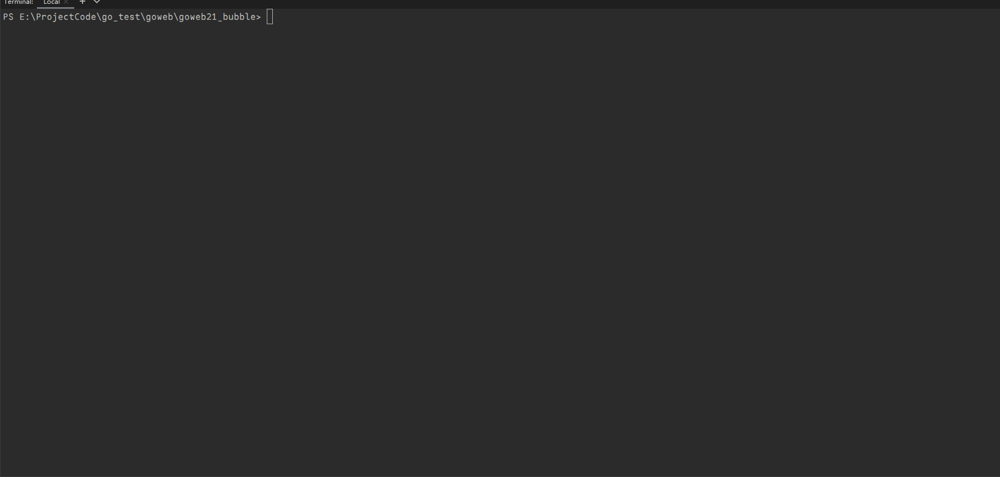
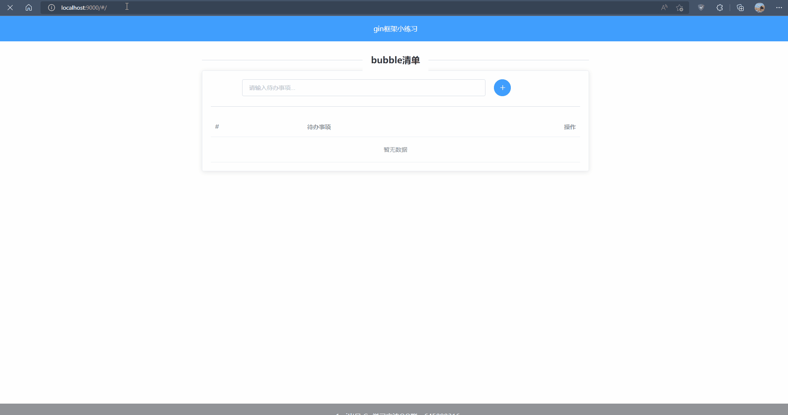

# goweb

### 1. 演示

- 启动

  

- 界面

  

### 2. 官网项目: [Go 语言之旅 (go-zh.org)](https://tour.go-zh.org/welcome/1)

### 3. 练习项目: [Go by Example 中文版 (gobyexample-cn.github.io)](https://gobyexample-cn.github.io/)

### 4. 参考博客: [李文周的博客 | 总结Go语言学习之路](https://www.liwenzhou.com/)

### 5. gin 官方文档: [文档 | Gin Web Framework (gin-gonic.com)](https://gin-gonic.com/zh-cn/docs/)

### 6. gorm 官方文档: [GORM 指南 | GORM - The fantastic ORM library for Golang, aims to be developer friendly.](https://gorm.io/zh_CN/docs/)

### 7. 参考视频: https://www.bilibili.com/video/BV1gJ411p7xC?p=27

