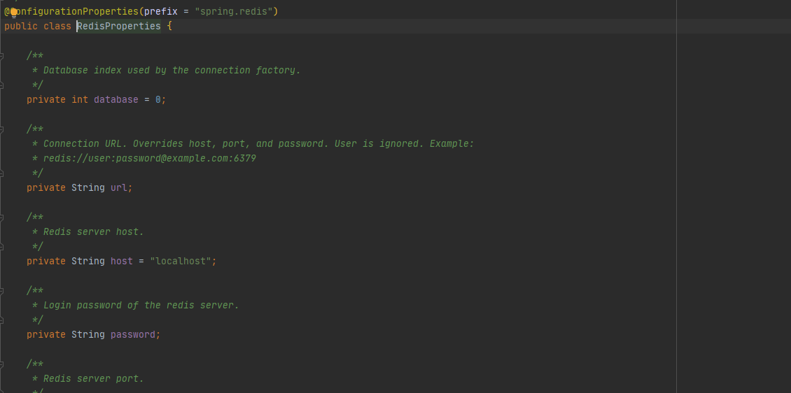
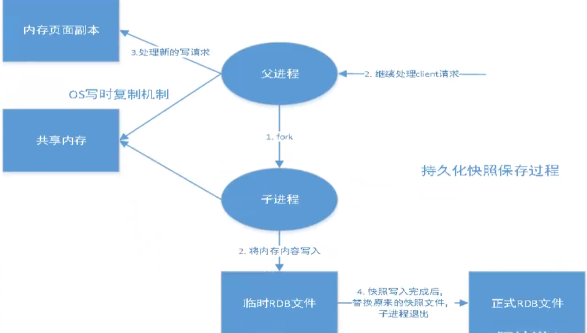

# Redis笔记

## 一. docker安装软件

### 1. 安装redis

安装环境: 207 环境

参考链接: https://blog.csdn.net/u010358168/article/details/97143703

```bash
#允许远程连接
bind 127.0.0.1
#保护模式
protected-mode no
#持久化
appendonly yes
#密码
requirepass 123456
```

执行命令:

```bash
docker run --name my_redis -p 6379:6379 -v /root/docker/redis/data:/data -v /root/docker/redis/conf/redis.conf:/etc/redis/redis.conf -d redis redis-server /etc/redis/redis.conf
```

docker执行后,可通过本地连接


性能测试命令

```bash
docker exec -it my_redis redis-benchmark -a 123456 -h localhost -p 6379 -c 100 -n 100000
```


登录及简单测试

```bash
docker exec -it my_redis redis-cli
```


### 2. redis的基本属性

1. 16个数据库

   

2. 常用的四个命令

   ```bash
   127.0.0.1:6379> DBSIZE #查看当前数据库大小
   (integer) 6
   127.0.0.1:6379> FLUSHDB
   OK
   127.0.0.1:6379> keys * #查看所有key值
   (empty array)
   127.0.0.1:6379> select 3
   OK
   127.0.0.1:6379[3]> DBSIZE
   (integer) 0
   127.0.0.1:6379[3]> set name zhangsan
   OK
   127.0.0.1:6379[3]> DBSIZE
   (integer) 1
   127.0.0.1:6379[3]> select 0 #select 切换数据库
   OK
   127.0.0.1:6379> set age 10
   OK
   127.0.0.1:6379> get age
   "10"
   127.0.0.1:6379> keys *
   1) "age"
   127.0.0.1:6379> flushall #清空所有数据库的值
   OK
   127.0.0.1:6379> DBSIZE
   (integer) 0
   127.0.0.1:6379> SELECT 3
   OK
   ```

   

3. redis是单线程的

   

## 二. 五大数据类型

### 1. redis的数据类型

官网链接: http://www.redis.cn/


- 命令来源[1]: http://www.redis.cn/commands.html#
- 命令来源[2]: https://www.redis.net.cn/order/


### 2. redis常用命令

```bash
127.0.0.1:6379> FLUSHALL #清空数据库
OK
127.0.0.1:6379> keys * #查看所有key
(empty array)
127.0.0.1:6379> set name zhangsan
OK
127.0.0.1:6379> set company shanxi
OK
127.0.0.1:6379> keys *
1) "company"
2) "name"
127.0.0.1:6379> DBSIZE
(integer) 2
127.0.0.1:6379> move name 1 #移除指定key ,1 代表数据库索引
(integer) 1
127.0.0.1:6379> keys *
1) "company"
127.0.0.1:6379> move name 2
(integer) 0
127.0.0.1:6379> set address tangyanRoad
OK
127.0.0.1:6379> keys *
1) "address"
2) "company"
127.0.0.1:6379> EXPIRE company 10 #设置过期时间
(integer) 1
127.0.0.1:6379> ttl company
(integer) 4
127.0.0.1:6379> ttl company
(integer) 2
127.0.0.1:6379> ttl company
(integer) 1
127.0.0.1:6379> ttl company
(integer) -2
127.0.0.1:6379> get conpany
(nil)
127.0.0.1:6379> keys *
1) "address"
127.0.0.1:6379> type address # 查看key的类型
string
```

### 3. 查看命令数据含义


### 4. String(字符串)

```bash
# append,STRLEN,EXISTS
127.0.0.1:6379> FLUSHALL # 清空数据
OK
127.0.0.1:6379> set address tangyanroad #set值
OK
127.0.0.1:6379> get address # 获取值
"tangyanroad"
127.0.0.1:6379> set age 20
OK
127.0.0.1:6379> keys *
1) "age"
2) "address"
127.0.0.1:6379> STRLEN address
(integer) 11
# APPEND 如果 key 已经存在，并且值为字符串，那么这个命令会把 value 追加到原来值（value）的结尾。 
# 如果 key 不存在,那么它将首先创建一个空字符串的key,再执行追加操作，这种情况 APPEND 将类似于 SET 操作
127.0.0.1:6379> append address ,name:zhangsan #追加值
(integer) 25
127.0.0.1:6379> STRLEN address #判断key对应的value值长度
(integer) 25
127.0.0.1:6379> EXISTS age #判断key值是否存在
(integer) 1
127.0.0.1:6379> EXISTS name
(integer) 0
127.0.0.1:6379> get address
"tangyanroad,name:zhangsan"
#####################################################
# INCR,DECR
127.0.0.1:6379> FLUSHALL
OK
127.0.0.1:6379> set no 1
OK
127.0.0.1:6379> INCR no
(integer) 2
127.0.0.1:6379> get no
"2"
# INCR 原子递增,对存储在指定key的数值执行原子的加1操作
# 如果指定的key不存在，那么在执行incr操作之前，会先将它的值设定为0。
127.0.0.1:6379> INCR no 
(integer) 3
127.0.0.1:6379> set totalcount 100
OK
#DECR 对key对应的数字做减1操作。如果key不存在，那么在操作之前，这个key对应的值会被置为0
127.0.0.1:6379> DECR totalcount 
(integer) 99
127.0.0.1:6379> DECR totalcount 
(integer) 98
########################################
# INCRBY,DECRBY
127.0.0.1:6379> set orderno 10
OK
127.0.0.1:6379> get orderno
"10"
127.0.0.1:6379> INCRBY orderno 5 #INCRBY 将key对应的数字加指定的整数 5
(integer) 15
127.0.0.1:6379> INCRBY orderno 3 #INCRBY 将key对应的数字加指定的整数 3
(integer) 18
127.0.0.1:6379> DECRBY orderno 9 #DECRBY 将key对应的数字减指定的整数 9
(integer) 9
127.0.0.1:6379> DECRBY orderno 7 #DECRBY 将key对应的数字减指定的整数 7
(integer) 2
127.0.0.1:6379> get orderno
"2"
##############################################
# GETRANGE,SETRANGE,setex,setnx
# SETNX是”SET if Not eXists”简写 | key值不存在时设置value值
# SETEX是"SET WITH EXPIRE" | 设置过期时间
127.0.0.1:6379> set name "When June comes, it means the summer is coming, too"
OK
127.0.0.1:6379> get name
"When June comes, it means the summer is coming, too"
#GETRANGE 获取存储在key上的值的一个子字符串
127.0.0.1:6379> GETRANGE name 10 15
"comes,"
#SETRANGE 从指定的位置开始,覆盖key对应的string的一部分
127.0.0.1:6379> SETRANGE name 10 "gogogo,"
(integer) 51
127.0.0.1:6379> GETRANGE name 0 -1 # 获取全部字符串内容
"When June gogogo,it means the summer is coming, too"
# 设置key对应字符串value，并且设置key在给定的seconds时间之后超时过期
127.0.0.1:6379> setex address 50 gaoxinroad
OK
127.0.0.1:6379> ttl address
(integer) 13
127.0.0.1:6379> get address
"gaoxinroad"
127.0.0.1:6379> ttl address
(integer) 0
127.0.0.1:6379> get address
(nil)
127.0.0.1:6379> setex telphone 30 12345678
OK
127.0.0.1:6379> ttl telphone
(integer) 24
127.0.0.1:6379> setnx telphone 13318888888
(integer) 0
127.0.0.1:6379> ttl telphone
(integer) 2
127.0.0.1:6379> setnx telphone 13318888888
(integer) 1
127.0.0.1:6379> ttl telphone
(integer) -1
127.0.0.1:6379> get telphone
"13318888888"
##################################################
# mset -- 同时设置多个值
# mget -- 同时获取多个值
# MSETNX -- 如果key值不存在,就设置该值为value
127.0.0.1:6379> mset name zhangsan age 20 address chengdu # 同时set多个值
OK
127.0.0.1:6379> keys *
1) "address"
2) "age"
3) "name"
127.0.0.1:6379> mget name age address # 同时获取多个值
1) "zhangsan"
2) "20"
3) "chengdu"
127.0.0.1:6379> MSETNX name lisisisi 
(integer) 0
127.0.0.1:6379> get name
"zhangsan"
#####  MSET MSETNX 的进阶用法   ######
127.0.0.1:6379> MSET user:1:name sunchengwu user:2:age 101 user:2:addrss beijing
OK
127.0.0.1:6379> keys *
1) "age"
2) "user:2:age"
3) "user:2:addrss"
4) "address"
5) "user:1:name"
6) "name"
# MSETNX 同时设置多个值,要么同时成功,要么同时失败 如果key值不存在,就设置该值,
127.0.0.1:6379> msetnx user:1:name chenglong user:3:company shanghai
(integer) 0
127.0.0.1:6379> mget user:1:name user:3:company
1) "sunchengwu"
2) (nil)
127.0.0.1:6379> keys *
1) "age"
2) "user:2:age"
3) "user:2:addrss"
4) "address"
5) "user:1:name"
6) "name"
#####################################################
# getset 用来获取值并set值 , 执行命令返回的结果
127.0.0.1:6379> keys *
1) "age"
2) "user:2:age"
3) "user:2:addrss"
4) "address"
5) "user:1:name"
6) "name"
# GETSET 设置一个key的value，并获取设置前的值
127.0.0.1:6379> getset doorsname five
(nil) 
127.0.0.1:6379> getset pricelevel 30
(nil) # 之前为 NULL
127.0.0.1:6379> keys *
1) "age"
2) "user:2:age"
3) "doorsname"
4) "pricelevel"
5) "user:2:addrss"
6) "address"
7) "user:1:name"
8) "name"
127.0.0.1:6379> mget doorsname pricelevel
1) "five"
2) "30"
127.0.0.1:6379> getset pricelevel 80
"30" # 之前为30, 设置为80
127.0.0.1:6379> mget doorsname pricelevel
1) "five"
2) "80"
```


### 5. List(列表)

```bash
# LPUSH 将所有指定的值插入到存于 key 的列表的头部
# LRANGE 返回存储在 key 的列表里指定范围内的元素
# RPUSH 从队列的右边入队一个元素
127.0.0.1:6379> LPUSH list zero
(integer) 1
127.0.0.1:6379> LPUSH list one
(integer) 2
127.0.0.1:6379> LPUSH list two
(integer) 3
127.0.0.1:6379> LPUSH list three
(integer) 4
# LRANGE 返回存储在 key 的列表里指定范围内的元素
# -1 表示列表的最后一个元素，-2 是倒数第二个，以此类推。
127.0.0.1:6379> LRANGE list 0 -1
1) "three"
2) "two"
3) "one"
4) "zero" 
127.0.0.1:6379> LRANGE list 0 0
1) "three"
127.0.0.1:6379> LRANGE list 0 -2
1) "three"
2) "two"
3) "one"
# RPUSH 从队列的右边入队一个元素
127.0.0.1:6379> RPUSH list right1
(integer) 5
127.0.0.1:6379> LRANGE list 0 -1
1) "three"
2) "two"
3) "one"
4) "zero"
5) "right1"
127.0.0.1:6379> LRANGE list 0 1
1) "three"
2) "two"
######################################################
127.0.0.1:6379> LRANGE list 0 -1
1) "three"
2) "two"
3) "one"
4) "zero"
5) "right1"
# LPOP 从头部移除并且返回 key 对应的 list 的第一个元素。
127.0.0.1:6379> LPOP list
"three"
127.0.0.1:6379> LRANGE list 0 -1
1) "two"
2) "one"
3) "zero"
4) "right1"
# RPOP 从尾部移除并且返回key对应的list的第一个元素
127.0.0.1:6379> RPOP list
"right1"
127.0.0.1:6379> LRANGE list 0 -1
1) "two"
2) "one"
3) "zero"
# RPOP 从尾部移除并且返回key对应的list,最后的多个元素, 2 代表的是元素个数
127.0.0.1:6379> RPOP list 2
1) "zero"
2) "one"
127.0.0.1:6379> LRANGE list 0 -1
1) "two"
##################################################
# LINDEX 获取一个元素，通过其索引列表
# LLEN 获得队列(List)的长度
127.0.0.1:6379> RPUSH mylist four
(integer) 1
127.0.0.1:6379> RPUSH mylist three
(integer) 2
127.0.0.1:6379> RPUSH mylist two
(integer) 3
127.0.0.1:6379> RPUSH mylist one
(integer) 4
127.0.0.1:6379> RPUSH mylist zero
(integer) 5
127.0.0.1:6379> LRANGE mylist 0 -1
1) "four"
2) "three"
3) "two"
4) "one"
5) "zero"
127.0.0.1:6379> LINDEX mylist 0
"four"
127.0.0.1:6379> LINDEX mylist 3
"one"
127.0.0.1:6379> LINDEX mylist 10
(nil)
#####################################################
127.0.0.1:6379> RPUSH mylist hello1
(integer) 1
127.0.0.1:6379> RPUSH mylist hello2
(integer) 2
127.0.0.1:6379> RPUSH mylist hello3
(integer) 3
127.0.0.1:6379> RPUSH mylist foo
(integer) 4
127.0.0.1:6379> LRANGE mylist 0 -1
1) "hello1"
2) "hello2"
3) "hello3"
4) "foo"
# LTRIM 让列表只保留指定区间内的元素，不在指定区间之内的元素都将被删除
127.0.0.1:6379> LTRIM mylist 1 -1
OK
127.0.0.1:6379> LRANGE mylist 0 -1
1) "hello2"
2) "hello3"
3) "foo"
127.0.0.1:6379> RPUSH mylist hello3
(integer) 4
127.0.0.1:6379> LRANGE mylist 0 -1
1) "hello2"
2) "hello3"
3) "foo"
4) "hello3"
# LREM 根据参数 COUNT 的值，移除列表中与参数 VALUE 相等的元素。
127.0.0.1:6379> LREM mylist 2 hello3
(integer) 2
127.0.0.1:6379> LRANGE mylist 0 -1
1) "hello2"
2) "foo"
###############################################
127.0.0.1:6379> LRANGE mylist 0 -1
1) "hello2"
2) "foo"
127.0.0.1:6379> RPOPLPUSH mylist newlist # 从原列表的尾部中移除一个值,放入到新列表的头部中
"foo"
127.0.0.1:6379> LRANGE mylist 0 -1
1) "hello2"
127.0.0.1:6379> LRANGE newlist 0 -1
1) "foo"
127.0.0.1:6379> RPOPLPUSH mylist newlist
"hello2"
127.0.0.1:6379> LRANGE mylist 0 -1 
(empty array)
127.0.0.1:6379> RPOPLPUSH mylist newlist # 如果移除的值为空,则返回null
(nil)
###############################################
# LSET 设置队列里面一个元素的值, 相当于根据索引更新key的value值
127.0.0.1:6379> EXISTS list
(integer) 0
127.0.0.1:6379> LSET list 0 zhangsan  # list的索引0值不存在,所以会报错
(error) ERR no such key
127.0.0.1:6379> LPUSH list other 
(integer) 1
127.0.0.1:6379> LSET list 0 zhangsan # 索引存在,则会更新掉
OK
127.0.0.1:6379> LRANGE list 0 -1
1) "zhangsan"
127.0.0.1:6379> LSET list 1 item # 索引不存在,则会报错
(error) ERR index out of range
##########################################################
# LINSERT 在列表中的一个元素的value值之前或之后插入另一个value值
127.0.0.1:6379> FLUSHALL
OK
127.0.0.1:6379> LPUSH mylist hello
(integer) 1
127.0.0.1:6379> LPUSH mylist world
(integer) 2
127.0.0.1:6379> LRANGE mylist 0 -1
1) "world"
2) "hello"
127.0.0.1:6379> LINSERT mylist before world the
(integer) 3
127.0.0.1:6379> LRANGE mylist 0 -1
1) "the"
2) "world"
3) "hello"
127.0.0.1:6379> LINSERT mylist after hello ", i'm fine"
(integer) 4
127.0.0.1:6379> LRANGE mylist 0 -1
1) "the"
2) "world"
3) "hello"
4) ", i'm fine"
```
### 6. Set(集合)

```bash
# SADD 添加一个或多个指定的member元素到集合的 key中
# SMEMBERS 查看集合中的内容
# SCARD 返回集合存储的key的基数 (集合元素的数量)
127.0.0.1:6379> SADD myset hello
(integer) 1
127.0.0.1:6379> SADD myset world 
(integer) 1
127.0.0.1:6379> SADD myset world 
(integer) 0
127.0.0.1:6379> SMEMBERS myset
1) "world"
2) "hello"
127.0.0.1:6379> SCARD myset
(integer) 2
######################################################
# SADD 返回一个集合与给定集合的差集的元素.
127.0.0.1:6379> SADD set1 "a"
(integer) 1
127.0.0.1:6379> SADD set1 "b"
(integer) 1
127.0.0.1:6379> SADD set1 "c"
(integer) 1
127.0.0.1:6379> SADD set2 "c"
(integer) 1
127.0.0.1:6379> SADD set2 "d"
(integer) 1
127.0.0.1:6379> SADD set2 "e"
(integer) 1
127.0.0.1:6379> SDIFF set1 set2
1) "a"
2) "b"
###################################################
# SREM 移除集合中某个元素值, 移除成功返回1, 元素不存在则返回0
127.0.0.1:6379> SADD myset "one"
(integer) 1
127.0.0.1:6379> SADD myset "two"
(integer) 1
127.0.0.1:6379> SADD myset "three"
(integer) 1
127.0.0.1:6379> SREM myset three
(integer) 1
127.0.0.1:6379> SREM myset four
(integer) 0
127.0.0.1:6379> SMEMBERS myset
1) "two"
2) "one"
#####################################################
# SRANDMEMBER 从集合中随机取值
127.0.0.1:6379> FLUSHALL
OK
127.0.0.1:6379> SADD myset one two three
(integer) 3
127.0.0.1:6379> SMEMBERS myset
1) "two"
2) "three"
3) "one"
127.0.0.1:6379> SRANDMEMBER myset 1
1) "one"
127.0.0.1:6379> SRANDMEMBER myset 1
1) "two"
127.0.0.1:6379> SRANDMEMBER myset 2
1) "two"
2) "one"
127.0.0.1:6379> SRANDMEMBER myset 2
1) "three"
2) "one"
127.0.0.1:6379> SRANDMEMBER myset -5
1) "three"
2) "three"
3) "one"
4) "two"
5) "one"
####################################################
# SPOP 从集合中随机弹出多个值,删除随机value值
127.0.0.1:6379> SMEMBERS myset
1) "two"
2) "three"
3) "one"
127.0.0.1:6379> SPOP myset  # 删除时取1个值
"three"
127.0.0.1:6379> SMEMBERS myset
1) "two"
2) "one"
127.0.0.1:6379> SADD myset four five
(integer) 2
127.0.0.1:6379> SPOP myset 2 # 删除时,指定取 2 个值
1) "two"
2) "four"
127.0.0.1:6379> SMEMBERS myset
1) "five"
2) "one"
###############################################
# SMOVE 将原来集合中的元素移动到新的集合中
127.0.0.1:6379> SADD addresslist shanghai beijing chengdu guangzhou
(integer) 4
127.0.0.1:6379> SMEMBERS addresslist
1) "chengdu"
2) "beijing"
3) "shanghai"
4) "guangzhou"
127.0.0.1:6379> SADD otherlist xian hangzhou
(integer) 2
127.0.0.1:6379> SMOVE addresslist otherlist "chengdu"
(integer) 1
127.0.0.1:6379> SMEMBERS addresslist 
1) "beijing"
2) "shanghai"
3) "guangzhou"
127.0.0.1:6379> SMEMBERS otherlist
1) "chengdu"
2) "xian"
3) "hangzhou"
##################################################
# SDIFF 返回一个集合与给定集合的差集的元素.
# SDIFFSTORE 与SDIFF 类似,只是将返回的集合存储在另外一个集合冲
# SINTER 与指定集合的交集
# SUNION 与指定集合的并集
127.0.0.1:6379> SADD myset1 a b c d
(integer) 4
127.0.0.1:6379> SADD myset2 c d e f
(integer) 4
127.0.0.1:6379> SDIFF myset1 myset2
1) "a"
2) "b"
127.0.0.1:6379> SDIFFSTORE myset myset1 myset2 # 返回myset1 中差异并存储在集合myset中
(integer) 2
127.0.0.1:6379> SMEMBERS myset1
1) "d"
2) "a"
3) "c"
4) "b"
127.0.0.1:6379> SMEMBERS myset2
1) "d"
2) "f"
3) "e"
4) "c"
127.0.0.1:6379> SMEMBERS myset
1) "a"
2) "b"
127.0.0.1:6379> SINTER myset1 myset2 # 两个集合的交集
1) "d"
2) "c"
127.0.0.1:6379> SUNION myset1 myset2 # 两个集合的并集
1) "b"
2) "d"
3) "c"
4) "f"
5) "a"
6) "e"
```


### 7. Hash(哈希)

> hash 类似于key-value键值对

```bash
#####################################
# HSET 向hash里面set值
# HMSET 向 hash 里面set多个值
# HGETALL 获取hash中的所有值
# HGET 从hash获取指定key的值
# HDEL # 删除指定的key值
# HEXISTS 判断key值是否存在
# HKEYS 只获取相应的key
# HVALS 只获取相应点风value值
# HINCRBY 增加 key 指定的哈希集中指定字段的数值
# HSETNX 只在 key 指定的哈希集中不存在指定的字段时，设置字段的值
127.0.0.1:6379> HSET myhash field1 foo # 向hash里面set值
(integer) 1
127.0.0.1:6379> HMSET myhash field1 hello field2 world field3 golang # 向hash中set多个值
OK
127.0.0.1:6379> HGET myhash field2 # 从hash获取指定key的值
"world"
127.0.0.1:6379> HGETALL myhash # 获取hash中的所有值
1) "field1"
2) "hello"
3) "field2"
4) "world"
5) "field3"
6) "golang"
127.0.0.1:6379> HDEL myhash field1 # 删除指定的key值,成功则返回1
(integer) 1
127.0.0.1:6379> HDEL myhash field1  # 删除指定的key值,失败则返回0
(integer) 0
127.0.0.1:6379> HGETALL myhash
1) "field2"
2) "world"
3) "field3"
4) "golang"
127.0.0.1:6379> HEXISTS myhash field1 # 判断key值是否存在. 不存在则返回0
(integer) 0
127.0.0.1:6379> HEXISTS myhash field2 # 判断key值是否存在,存在则返回1 
(integer) 1
127.0.0.1:6379> HKEYS myhash # 只获取相应的key
1) "field2"
2) "field3"
127.0.0.1:6379> HVALS myhash # 只获取相应的value值
1) "world"
2) "golang"
#####################################################
127.0.0.1:6379> HGETALL myhash
1) "field2"
2) "world"
3) "field3"
4) "golang"
5) "file4"
6) "5"
127.0.0.1:6379> HINCRBY myhash file4 3 # 增加 key 指定的哈希集中指定字段的数值
(integer) 8
127.0.0.1:6379> HINCRBY myhash file4 -10
(integer) -2
127.0.0.1:6379> HGETALL myhash
1) "field2"
2) "world"
3) "field3"
4) "golang"
5) "file4"
6) "-2"
##################################################
127.0.0.1:6379> HSETNX myhash file4 50 # key值存在,则set失败,返回0
(integer) 0
127.0.0.1:6379> HGETALL myhash
1) "field2"
2) "world"
3) "field3"
4) "golang"
5) "file4"
6) "-2"
127.0.0.1:6379> HSETNX myhash field5 88 # key值不存在, 则set成功,则返回1
(integer) 1
127.0.0.1:6379> HGETALL myhash 
1) "field2"
2) "world"
3) "field3"
4) "golang"
5) "file4"
6) "-2"
7) "field5"
8) "88"
```


### 8. ZSet (有序集合)

> Sorted Set (有序集合)通常我们也称为 zset，指的是在 redis 中，通常以 zset add 等命令操作

```bash
# ZADD 添加到有序set的一个或多个成员，或更新的分数，如果它已经存在
# ZRANGEBYSCORE 返回有序集合中指定分数区间内的成员，分数由低到高排序。
# ZREVRANGEBYSCORE 由大到小排序,其它语法和 ZRANGEBYSCORE 相同
# ZCOUNT 获取指定区间的成员数量
# ZCARD 获取有序集合中的元素个数
# ZREM 移除有序集合中的元素
127.0.0.1:6379> zadd myzset 1 "one" 
(integer) 1
# 添加多个键值对到zset中, 20000-zhangsan 300-wangwu 4500-qinshihuang
127.0.0.1:6379> ZADD myzset 2000 zhangsan 300 wangwu 4500 qinshihuang 
(integer) 3
# ZRANGEBYSCORE 返回有序集合中指定分数区间内的成员，分数由低到高排序。min和max可以是-inf和+inf
127.0.0.1:6379> ZRANGEBYSCORE myzset -inf +inf
1) "one"
2) "wangwu"
3) "zhangsan"
4) "qinshihuang"
127.0.0.1:6379> ZRANGEBYSCORE myzset 1 300 # 返回所有符合 1 <= score <= 300 的成员
1) "one"
2) "wangwu"
127.0.0.1:6379> ZRANGEBYSCORE myzset 1 (300 # 返回所有符合 1 <= score < 300 的成员
1) "one"
127.0.0.1:6379> keys *
1) "myzset"
#返回所有符合无穷小(-inf)<=score < 300 的成员,并且返回对应的score值,由小到大排序
127.0.0.1:6379> ZRANGEBYSCORE myzset -inf 300 withscores 
1) "one"
2) "1"
3) "wangwu"
4) "300"
# ZREVRANGEBYSCORE 由大到小进行排序 
127.0.0.1:6379> ZREVRANGEBYSCORE myzset +inf -inf withscores
1) "qinshihuang"
2) "4500"
3) "zhangsan"
4) "2000"
5) "wangwu"
6) "300"
7) "one"
8) "1"
##############################################################
# ZREM 移除有序集合中的元素
127.0.0.1:6379> ZRANGE myzset 0 -1 withscores # 查询所有的值
1) "one"
2) "1"
3) "wangwu"
4) "300"
5) "zhangsan"
6) "2000"
7) "qinshihuang"
8) "4500"
127.0.0.1:6379> ZREM myzset wangwu # 移除有序集合中的元素
(integer) 1
127.0.0.1:6379> ZRANGE myzset 0 -1 withscores
1) "one"
2) "1"
3) "zhangsan"
4) "2000"
5) "qinshihuang"
6) "4500"
127.0.0.1:6379> ZCOUNT myzset 0 2000 # 有序集合中,指定区间内的元素个数 0 <= score <= 2000
(integer) 2
127.0.0.1:6379> zcard myzset  # 返回元素个数
(integer) 3
```

## 三. Redis的三种特殊数据类型

### 1.   [geospatial（地理空间）](http://www.redis.cn/commands/geoadd.html)

> 借助网页工具: http://www.jsons.cn/lngcode/


> - GEOADD 将指定的地理空间位置（纬度、经度、名称）添加到指定的key中

- 有效的经度从-180度到180度。
- 有效的纬度从-85.05112878度到85.05112878度

```bash
127.0.0.1:6379> GEOADD city 118.376451 31.326319 "wuhu"  121.472644 31.231706 "shanghai"
(integer) 2
# 返回两个地点的距离, 如果用户没有显式地指定单位参数, 那么 GEODIST 默认使用米作为单位
```

> GEOPOS 获取定位信息

```bash
127.0.0.1:6379> GEOPOS city wuhu shanghai chengdu
1) 1) "118.37644904851913452"
   2) "31.32631844381271691"
2) 1) "121.47264629602432251"
   2) "31.23170490709807012"
3) (nil)
```

> GEODIST 返回两个给定位置之间的距离

- m  表示单位为米
- km 表示单位为千米
- mi 表示单位为英里
- ft 表示单位为英尺

```bash
127.0.0.1:6379> GEODIST city wuhu shanghai km
"294.5012"
```

> [GEORADIUS 命令](https://www.redis.net.cn/order/3689.html) 以给定的经纬度为中心， 找出某一半径内的元素

所有坐标数据应该录入到 **china:shanghai**

```bash
127.0.0.1:6379> GEOADD china:shanghai 121.43676 31.18831 xuhui 121.42462 31.22036 changning 121.4444 31.22884 jingan 
(integer) 3
127.0.0.1:6379> GEOADD china:shanghai 121.38162 31.11246 minhang 121.39758 31.62278 chongming
(integer) 2
127.0.0.1:6379> GEOPOS china:shanghai minhang chongming changning jingan xuhui
1) 1) "121.38161748647689819"
   2) "31.11245895015697016"
2) 1) "121.39758199453353882"
   2) "31.62277943060899332"
3) 1) "121.42461866140365601"
   2) "31.22035949518886611"
4) 1) "121.44440263509750366"
   2) "31.22884067218802073"
5) 1) "121.43675833940505981"
   2) "31.18831048085018409"
# 以坐标 121, 31 为中心, 查询50km内的坐标
127.0.0.1:6379> GEORADIUS china:shanghai 121 31 50 km withcoord
1) 1) "minhang"
   2) 1) "121.38161748647689819"
      2) "31.11245895015697016"
2) 1) "xuhui"
   2) 1) "121.43675833940505981"
      2) "31.18831048085018409"
3) 1) "changning"
   2) 1) "121.42461866140365601"
      2) "31.22035949518886611"
4) 1) "jingan"
   2) 1) "121.44440263509750366"
      2) "31.22884067218802073"
# 以121,31 为中心, 显示中心距离的位置
127.0.0.1:6379> GEORADIUS china:shanghai 121 31 50 km withdist 
1) 1) "minhang"
   2) "38.4530"
2) 1) "xuhui"
   2) "46.5745"
3) 1) "changning"
   2) "47.2843"
4) 1) "jingan"
   2) "49.3830"
# 以121,31 为中心,查询50km的距离,筛选出指定的结果
127.0.0.1:6379> GEORADIUS china:shanghai 121 31 50 km withdist count 2 
1) 1) "minhang"
   2) "38.4530"
2) 1) "xuhui"
   2) "46.5745"
 
```

> [GEORADIUSBYMEMBER](https://www.redis.net.cn/order/3690.html) 找出位于指定范围内的元素，中心点是由给定的位置元素决定

```bash
127.0.0.1:6379> geoadd china:shanghai 120.57345 31.2953 suzhou
(integer) 1
#找出距离中心点suzhou的100km的数据
127.0.0.1:6379> GEORADIUSBYMEMBER  china:shanghai suzhou 100 km 
1) "suzhou"
2) "minhang"
3) "xuhui"
4) "changning"
5) "jingan"
6) "chongming"
```

> [GEOHASH](https://www.redis.net.cn/order/3687.html) 返回一个或多个位置元素的 Geohash 表示

- 返回==11==个字符的Geohash字符串
- 字符串越接近,距离越近; 反之亦然

```bash
127.0.0.1:6379> GEOHASH china:shanghai minhang jingan
1) "wtw2fpg7hw0"
2) "wtw3et115t0"
```


> GEO 底层实际使用的是 sorted set 命令,所以可以使用zset命令

```bash
127.0.0.1:6379> ZRANGE china:shanghai 0 -1 # 查看所有的元素
1) "hangzhou"
2) "suzhou"
3) "minhang"
4) "xuhui"
5) "changning"
6) "jingan"
7) "chongming"
127.0.0.1:6379> zrem china:shanghai suzhou minhang # 移除其中的元素
(integer) 2
127.0.0.1:6379> ZRANGE china:shanghai 0 -1
1) "hangzhou"
2) "xuhui"
3) "changning"
4) "jingan"
5) "chongming"
```


### 2.  [hyperloglogs](http://www.redis.cn/topics/data-types-intro.html#hyperloglogs) 

> 什么是基数?
>
> 参考链接: https://www.runoob.com/redis/redis-hyperloglog.html

比如数据集 {1, 3, 5, 7, 5, 7, 8}， 那么这个数据集的基数集为 {1, 3, 5 ,7, 8}, 基数(不重复元素)为5。 基数估计就是在误差可接受的范围内，快速计算基数。


> 命令

| 命令                                                         | 描述                                      |
| :----------------------------------------------------------- | :---------------------------------------- |
| [Redis Pgmerge 命令](https://www.redis.net.cn/order/3631.html) | 将多个 HyperLogLog 合并为一个 HyperLogLog |
| [Redis Pfadd 命令](https://www.redis.net.cn/order/3629.html) | 添加指定元素到 HyperLogLog 中。           |
| [Redis Pfcount 命令](https://www.redis.net.cn/order/3630.html) | 返回给定 HyperLogLog 的基数估算值。       |

> 代码

```bash
127.0.0.1:6379> PFADD mykey a b c d e f g h i #PFADD 创建第一组元素值
(integer) 1
127.0.0.1:6379> PFCOUNT mykey #PFCOUNT 获取元素数量
(integer) 9
127.0.0.1:6379> PFADD mykey2 c d e x y z #PFADD 创建第二组元素值
(integer) 1
127.0.0.1:6379> PFCOUNT mykey2
(integer) 6
#PFMERGE 将两组数据mykey mykey2合并,求并集输出到keyConbine
127.0.0.1:6379> PFmerge keyConbine mykey mykey2
OK
127.0.0.1:6379> PFCOUNT keyConbine
(integer) 12
```

如果==允许容错==,那么一定可以使用 hyperloglogs !

如果==不允许容错==, 那么使用set或者自己的数据类型即可!

### 3.  [bitmaps](http://www.redis.cn/topics/data-types-intro.html#bitmaps)(位存储)

> 特点

1. 统计用户信息, 活跃度.是否登录,也可用来记录==考勤==信息
2. Bitmaps位图, 数据结构

> - 参考链接: https://juejin.cn/post/6844903561839525902


> SETBIT key offset value 

-  value参数，只能有`两个参数`, 可以是 `0` 也可以是 `1`
- 当`key` 不存在时, 自动生成一个新的字符串

> BITCOUNT key start

- `start` 和 `end` 参数的设置和 `GETRANGE` 命令类似，都可以使用负数值： 比如 `-1` 表示最后一个字节， `-2`表示倒数第二个字节，以此类推
- `返回值`：被设置为 `1` 的位的数量

```bash
# 设置该用户在202102月份中的打卡记录, 1-代表打卡 0-代表未打卡
127.0.0.1:6379> setbit user:zhangsan 20210201 1 
(integer) 0
127.0.0.1:6379> setbit user:zhangsan 20210202 0
(integer) 0
127.0.0.1:6379> setbit user:zhangsan 20210203 1
(integer) 0
127.0.0.1:6379> setbit user:zhangsan 20210204 1
(integer) 0
127.0.0.1:6379> setbit user:zhangsan 20210205 1
(integer) 0
127.0.0.1:6379> setbit user:zhangsan 20210206 0
(integer) 0
127.0.0.1:6379> getbit user:zhangsan 20210205
(integer) 1
127.0.0.1:6379> getbit user:zhangsan 20210206 # 获取当天的记录
(integer) 0
127.0.0.1:6379> BITCOUNT user:zhangsan # 获取所有结果中为1的记录
(integer) 4
```

## 四. 事务

### 事务特性

==redis单条执行命令时是有原子性的, redis的事务没有原子性==

一次性 顺序性 排他性!顺序的执行一些命令

redis命令执行时,可分为三步:

- 开启事务(MULTI)
- 命令入队(.........)
- 执行事务(EXEC)或取消事务(DISCARD)

| 命令                                                         | 描述                                                         |
| :----------------------------------------------------------- | :----------------------------------------------------------- |
| [Redis Exec 命令](https://www.redis.net.cn/order/3639.html)  | 执行所有事务块内的命令。                                     |
| [Redis Watch 命令](https://www.redis.net.cn/order/3642.html) | 监视一个(或多个) key ，如果在事务执行之前这个(或这些) key 被其他命令所改动，那么事务将被打断。 |
| [Redis Discard 命令](https://www.redis.net.cn/order/3638.html) | 取消事务，放弃执行事务块内的所有命令。                       |
| [Redis Unwatch 命令](https://www.redis.net.cn/order/3641.html) | 取消 WATCH 命令对所有 key 的监视。                           |
| [Redis Multi 命令](https://www.redis.net.cn/order/3640.html) | 标记一个事务块的开始。                                       |

> 开启事务

```bash
127.0.0.1:6379> MULTI # 开启事务
OK
127.0.0.1:6379(TX)> set k1 v1
QUEUED
127.0.0.1:6379(TX)> set k2 v2
QUEUED
127.0.0.1:6379(TX)> get k2
QUEUED
127.0.0.1:6379(TX)> set k3 v3
QUEUED
127.0.0.1:6379(TX)> EXEC # 执行事务
1) OK
2) OK
3) "v2"
4) OK

```

> 取消事务

```bash
127.0.0.1:6379> MULTI
OK
127.0.0.1:6379(TX)> ping
QUEUED
127.0.0.1:6379(TX)> set name "jokes"
QUEUED
127.0.0.1:6379(TX)> DISCARD
OK
127.0.0.1:6379> get name
(nil)
```

> 编译型错误(代码有问题,命令有误) 事务中 所有的命令不会被执行

```bash
127.0.0.1:6379> MULTI
OK
127.0.0.1:6379(TX)> set name zhangsan
QUEUED
127.0.0.1:6379(TX)> set age 80
QUEUED
127.0.0.1:6379(TX)> getset age # 出现了一个报错信息
(error) ERR wrong number of arguments for 'getset' command
127.0.0.1:6379(TX)> get age
QUEUED
127.0.0.1:6379(TX)> exec # 执行命令后报错,事务没有执行成功
(error) EXECABORT Transaction discarded because of previous errors.
127.0.0.1:6379> get age # 无法获取到参数
(nil)
```


> 运行时异常(例如: 1/0) 如果事务队列中语法无误,那么执行命令的时候, 其它命令是可以正常执行的,错误命令会抛出异常 

```bash
127.0.0.1:6379> set age ten
OK
127.0.0.1:6379> MULTI
OK
127.0.0.1:6379(TX)> INCR age # 这个执行的时候会失败
QUEUED
127.0.0.1:6379(TX)> set key2 v2
QUEUED
127.0.0.1:6379(TX)> set address beijing
QUEUED
127.0.0.1:6379(TX)> set key3 v3
QUEUED
127.0.0.1:6379(TX)> EXEC # 事务执行的第一条会失败,其余的会成功
1) (error) ERR value is not an integer or out of range 
2) OK
3) OK
4) OK
127.0.0.1:6379> get key3
"v3"
```

> 监控

使用场景: ==秒杀活动==

```bash
127.0.0.1:6379> set inmoney 100
OK
127.0.0.1:6379> set out 0
OK
127.0.0.1:6379> watch inmoney # 监视key,事务被成功执行
OK
127.0.0.1:6379> MULTI
OK
127.0.0.1:6379(TX)> DECRBY inmoney 20
QUEUED
127.0.0.1:6379(TX)> INCRBY out 20
QUEUED
127.0.0.1:6379(TX)> exec
1) (integer) 80
2) (integer) 20

```

> 实现乐观锁

- check-and-set 操作实现乐观锁

- WATCH 命令可以为 Redis 事务提供 check-and-set （CAS）行为

`part 1`

```bash
127.0.0.1:6379> keys *
1) "debitmoney"
2) "creditmoney"
127.0.0.1:6379> get debitmoney
"0"
127.0.0.1:6379> get creditmoney
"600"
127.0.0.1:6379> watch creditmoney # 监视key,事务被打断
OK
127.0.0.1:6379> MULTI
OK
127.0.0.1:6379(TX)> DECRBY creditmoney 3
QUEUED
127.0.0.1:6379(TX)> INCRBY debitmoney 3 
QUEUED
# 命令入队之后,未执行EXEC,另外一个客户端修改 creditmoney 数据
127.0.0.1:6379(TX)> EXEC 
(nil) # 因为creditmoney 被修改,造成 creditmoney 事务被中断
127.0.0.1:6379> get creditmoney
"1000"

```

``part 2`` 

```bash
127.0.0.1:6379> MULTI
OK
127.0.0.1:6379(TX)> set creditmoney 1000 # 就在这时，这个客户端修改了 creditmoney 的值
QUEUED
127.0.0.1:6379(TX)> EXEC
1) OK
```

`part 3`: 解决方案,使用``unwatch``命令后,重新执行

```bash
127.0.0.1:6379> unwatch # 取消 WATCH 命令对所有 key 的监视。
OK
127.0.0.1:6379> get creditmoney
"1000"
127.0.0.1:6379> watch creditmoney
OK
127.0.0.1:6379> MULTI
OK
127.0.0.1:6379(TX)> DECRBY creditmoney 30
QUEUED
127.0.0.1:6379(TX)> INCRBY debitmoney 30
QUEUED
127.0.0.1:6379(TX)> EXEC
1) (integer) 970
2) (integer) 30
```


## 五. Jedis Demo

> Jedis是Redis官方推荐的Java连接开发工具

```xml
<?xml version="1.0" encoding="UTF-8"?>
<project xmlns="http://maven.apache.org/POM/4.0.0"
         xmlns:xsi="http://www.w3.org/2001/XMLSchema-instance"
         xsi:schemaLocation="http://maven.apache.org/POM/4.0.0 http://maven.apache.org/xsd/maven-4.0.0.xsd">
    <modelVersion>4.0.0</modelVersion>

    <groupId>org.example</groupId>
    <artifactId>jedis_test</artifactId>
    <version>1.0-SNAPSHOT</version>
    <dependencies>
        <!--测试jedis-->
        <!-- https://mvnrepository.com/artifact/redis.clients/jedis -->
        <dependency>
            <groupId>redis.clients</groupId>
            <artifactId>jedis</artifactId>
            <version>3.7.0</version>
        </dependency>

        <!--连接jedis-->
        <!-- https://mvnrepository.com/artifact/com.alibaba/fastjson -->
        <dependency>
            <groupId>com.alibaba</groupId>
            <artifactId>fastjson</artifactId>
            <version>1.2.78</version>
        </dependency>

    </dependencies>

</project>
```


### 1.  String

```java
/**
 * @description: TODO 测试数据类型String
 * @date: 2021/10/23
 * @version: 1.0
 */
public class StringDemo {
    public static void main(String[] args) {

        Jedis jedis = new Jedis("192.168.235.210", 6379);

        jedis.auth("123456");
        jedis.flushDB();

        System.out.println("String单个赋值: "+jedis.set("name", "zhangsan"));
        System.out.println("同时给多个字段赋值: "+jedis.mset("address", "gaoxinRoad", "age", "23"));
        System.out.println("String里面的keys: "+jedis.keys("*"));
        System.out.println("获取到所有的values值: " +jedis.mget(jedis.keys("*").toArray(new String[jedis.keys("*").size()])));
        System.out.println("String 的value值: "+jedis.get("age"));
        System.out.println("String的incr方法"+jedis.incrBy("age", 25));
        System.out.println("获取value值的长度: "+jedis.strlen("address"));
        System.out.println("String的ex方法(设置过期时间): "+jedis.setex("company", 60,"shanghai"));
        System.out.println("key值未过期时: "+jedis.get("company"));
        System.out.println("查看过期时间: "+jedis.ttl("company"));
        System.out.println("nx方法[1]: "+jedis.setnx("company", "chongqing"));
        try {
            TimeUnit.SECONDS.sleep(60);
        } catch (InterruptedException e) {
            e.printStackTrace();
        }
        System.out.println("nx方法[2]: "+jedis.setnx("company", "guangzhou"));
        System.out.println("key值已过期时: "+jedis.get("company"));
        jedis.append("address",", shannxi province xian shi.");
        System.out.println("==============================================");
        System.out.println("String单个赋值: "+jedis.set("say", "Hello World"));
        System.out.println("替换掉指定位置的: "+jedis.setrange("say", 6, "Redis"));
        System.out.println("查看替换后的值: "+jedis.get("say"));

    }
}

```

### 2. List

```java
/**
 * @description: TODO 测试数据类型 List
 * @date: 2021/10/23
 * @version: 1.0
 */
public class ListDemo {
    public static void main(String[] args) {
        Jedis jedis = new Jedis("192.168.235.210", 6379);

        jedis.auth("123456");
        jedis.flushDB(); //清空数据库

        System.out.println("List 在头部赋值: "+jedis.lpush("students", "bar", "Hello", "world"));
        System.out.println("List 获取key值长度: "+jedis.llen("students"));
        System.out.println("List 获取参数: "+jedis.lrange("students", 0, -1));
        System.out.println("List 从尾部赋值:"+jedis.rpush("students", "Redis", "computer", "bar"));
        System.out.println("List 头部索引值: "+jedis.lindex("students", -1));
        System.out.println("List 尾部索引值: "+jedis.lindex("students", 0));
        System.out.println("List 获取所有参数: "+jedis.lrange("students", 0, -1));
        System.out.println("List 移除bar值"+jedis.lrem("students", 2, "bar"));
        System.out.println("List 在列表的元素前插入元素"+jedis.linsert("students", BEFORE, "Redis", "Yes"));
        System.out.println("List 获取所有参数: "+jedis.lrange("students", 0, -1));
        System.out.println("List 从尾部弹出key值"+jedis.rpop("students"));
        System.out.println("List 获取所有参数: "+jedis.lrange("students", 0, -1));
        System.out.println("List 在头部插入该值: "+jedis.lpushx("students", "hahaha"));
        System.out.println("List 获取所有参数: "+jedis.lrange("students", 0, -1));

    }
}
```

### 3. Hash

```java
/**
 * @description: TODO 测试redis中的hash数据类型 ,实质就是key-value值
 * @author: qpf
 * @date: 2021/10/23
 * @version: 1.0
 */
public class HashDemo {
    public static void main(String[] args) {
        Jedis jedis = new Jedis("192.168.235.210", 6379);

        jedis.auth("123456");
        jedis.flushDB(); //清空数据库

        Map<String, String> userInfo = new HashMap<>();
        userInfo.put("name","zhangsan");
        userInfo.put("age","37");
        userInfo.put("sex","man");

        System.out.println("Hash 同时添加多个key值: "+jedis.hmset("company:zhongtie:1",userInfo));
        System.out.println("Hash 新增单个key值"+jedis.hset("company:zhongtie:2", "name", "wangwu"));
        System.out.println("Hash 获取所有的字段键值对的field name值"+jedis.hkeys("company:zhongtie:1"));
        System.out.println("Hash 获取所有的key值"+jedis.keys("*"));
        System.out.println("Hash 获取所有的键值对"+jedis.hgetAll("company:zhongtie:1"));
        System.out.println("Hash 判断key值中的键值对存在时"+jedis.hexists("company:zhongtie:2", "name"));
        System.out.println("Hash 判断key值中的键值对不存在时"+jedis.hexists("company:zhongtie:2", "address"));
        System.out.println("Hash 判断key值中的field值加上指定增量值"+jedis.hincrBy("company:zhongtie:1", "age", 30));
        System.out.println("Hash 获取所有的键值对"+jedis.hgetAll("company:zhongtie:1"));
        System.out.println("Hash 移除不存在的值:"+jedis.hdel("company:zhongtie:1", "foo"));
        System.out.println("Hash 获取key值长度[0]:"+jedis.hlen("company:zhongtie:1"));
        System.out.println("Hash 移除存在的值:"+jedis.hdel("company:zhongtie:1", "sex"));
        System.out.println("Hash 获取key值长度[1]:"+jedis.hlen("company:zhongtie:1"));


    }
}

```

### 4. Set

```java
/**
 * @description: TODO 测试Redis中set值
 * @date: 2021/10/23
 * @version: 1.0
 */
public class SetDemo {
    public static void main(String[] args) {
        Jedis jedis = new Jedis("192.168.235.210", 6379);

        jedis.auth("123456");
        jedis.flushDB(); //清空数据库

        System.out.println("Set 同时添加多个元素"+jedis.sadd("myset", "Hello", "World"));
        System.out.println("Set 查看所有的元素信息"+jedis.smembers("myset"));
        System.out.println("Set 查看所有的key值个数"+jedis.scard("myset"));
        System.out.println("===================================");
        jedis.flushDB();
        System.out.println("Set 同时添加多个key值: "+jedis.sadd("set1", "a", "b", "c"));
        System.out.println("Set 同时添加多个key值: "+jedis.sadd("set2", "c", "d", "b"));
        System.out.println("Set key1与 两个key值交集部分 的区别: "+jedis.sdiff("set1", "set2"));
        System.out.println("===================================");
        jedis.flushDB();
        System.out.println("Set 同时添加多个成员值: "+jedis.sadd("company1", "one", "two", "three"));
        System.out.println("Set 同时移除多个成员值: "+jedis.srem("company1", "three", "four"));
        System.out.println("Set 查看key中所有成员[1]: "+jedis.smembers("company1"));
        System.out.println("Set 同时添加多个成员值: "+jedis.sadd("company1", "five", "six", "eight"));
        System.out.println("Set 查看key中所有成员[2]: "+jedis.smembers("company1"));
        System.out.println("Set 随机打印2个成员值-1: "+jedis.srandmember("company1", 2));
        System.out.println("Set 随机打印2个成员值-2: "+jedis.srandmember("company1", 2));
        //如果 count 为负数，那么命令返回一个数组，数组中的元素可能会重复出现多次，而数组的长度为 count 的绝对值。
        System.out.println("Set 随机打印3个成员值-3: "+jedis.srandmember("company1", -3));
        System.out.println("Set 随机移除1个成员: "+jedis.spop("company1"));
        System.out.println("Set 随机移除指定成员: "+jedis.srem("company1", "six", "ten"));
        System.out.println("Set 查看key中所有成员[3]: "+jedis.smembers("company1"));
        System.out.println("Set 同时添加多个成员值: "+jedis.sadd("company2", "apple", "huawei", "sanxing", "one", "two"));
        System.out.println("Set 移动指定成员到另外的key中: "+jedis.smove("company1", "company2", "eight"));
        System.out.println("Set 查看key1中所有成员[4]: "+jedis.smembers("company1"));
        System.out.println("Set 查看key2中所有成员[5]: "+jedis.smembers("company2"));
        System.out.println("Set 两个key值的交集: "+jedis.sinter("company1", "company2"));
        System.out.println("Set 两个key值的并集: "+jedis.sunion("company1", "company2"));


    }
}

```


### 5. Zset

```java
/**
 * @description: TODO 测试 redis 中 Zset
 * @date: 2021/10/23
 * @version: 1.0
 */
public class ZsetDemo {
    public static void main(String[] args) {
        Jedis jedis = new Jedis("192.168.235.210", 6379);

        jedis.auth("123456");
        jedis.flushDB();


        Map<String, Double> zmap  = new HashMap<>();
        zmap.put("zhangsan",2000.00);
        zmap.put("wangwu",500.00);
        zmap.put("lisisi",3000.00);
        System.out.println("Zset 同时添加字段值: "+jedis.zadd("myzset", zmap));
        System.out.println("Zset 查看所有的值(由小到大排序): "+jedis.zrangeWithScores("myzset",0L,-1L));
        System.out.println("Zset 查看(由小到大排序)的索引值: "+jedis.zrangeWithScores("myzset", 1L, 2L));
        System.out.println("Zset 查看 500 <= scode <= 600值: "+jedis.zrangeByScore("myzset", 500, 600));
        System.out.println("Zset 查看(由大到小)的值: "+jedis.zrevrangeByScoreWithScores("myzset", 3000L, 0L));

    }
}

```


### 6. 事务

>  扩展: ==乐观锁==

1. mybatis plus 乐观锁(version)
2. redis乐观锁 (watch)
3. CAS(compare and swap)算法


```java
package com.redis.jedis.test;

import redis.clients.jedis.Jedis;
import redis.clients.jedis.Transaction;

/**
 * @description: TODO 测试 Redis 中的 事务
 * @author: qpf
 * @date: 2021/10/23
 * @version: 1.0
 */
public class TransactionDemo {
    public static void main(String[] args) {
        Jedis jedis = new Jedis("192.168.235.210", 6379);

        jedis.auth("123456");
        jedis.flushDB();

        Transaction multi = jedis.multi();

        try {
            multi.set("name","zhangsan");
            multi.set("address", "ahahahahahhaha");
            int a = 1/0;
            multi.exec(); // 执行事务
        } catch (Exception e) {
            multi.discard();
            e.printStackTrace();
        } finally {
            System.out.println(jedis.get("name"));
            System.out.println(jedis.get("address"));
            jedis.close(); //关闭事务
        }
    }

}

```


## 六. 结合SpringBoot


### 1. 查看Redis的默认属性

> Properties文件,配置时可参考这个




> 使用 **Lettuce** 的原理

参考链接: https://www.cnblogs.com/Howinfun/p/12198825.html

首先 `Redis` 的自动化配置依靠的是 `RedisAutoConfiguration` ，而 `RedisAutoConfiguration` 会按照顺序分别引入 `LettuceConnectionConfiguration` 和 `JedisConnectionConfiguration` 。而它们都会判断 `Spring容器` 中是否存在 `ConnectionFactory` ，不存在则创建。正是这个**引入的顺序**，导致 `LettuceConnectionConfiguration` 要先比 `JedisConnectionConfiguration` 执行，所以当 `LettuceConnectionConfiguration` 创建了 `ConnectionFactory` 后， `JedisConnectionConfiguration` 判断不为空而不继续创建了。所以即使我们引入了 `Jedis` 依赖，最后也还是使用 `Lettuce` 客户端。


`ps`： **Spring Boot 2.x** 使用 **Lettuce** 的原理：首先是依靠 ==**@Import** 的引入顺序==，然后是 **spring-boot-starter-data-redis** 里有 **Lettuce** 的依赖，而没有 **Jedis** 的依赖 。

``Part 1`` :引入顺序


-  JedisConnection 导包时会出现异常

  

- LettuceConnection 导包时不会出现异常


``Part 2`` :  **spring-boot-starter-data-redis** 里的 **Lettuce** 的依赖

```xml
<dependency>
    <groupId>org.springframework.boot</groupId>
    <artifactId>spring-boot-starter-data-redis</artifactId>
</dependency>
<dependency>
    <groupId>org.springframework.boot</groupId>
    <artifactId>spring-boot-starter-web</artifactId>
</dependency>
<dependency>
    <groupId>org.springframework.boot</groupId>
    <artifactId>spring-boot-devtools</artifactId>
    <scope>runtime</scope>
    <optional>true</optional>
</dependency>
<dependency>
    <groupId>org.springframework.boot</groupId>
    <artifactId>spring-boot-configuration-processor</artifactId>
    <optional>true</optional>
</dependency>
```


### 2. 测试使用

> properties文件

```properties
#redis的配置信息
spring.redis.host=192.168.235.210
spring.redis.port=6379
spring.redis.database=1
```

> RedisAutoConfiguration 类

```java
@Configuration(proxyBeanMethods = false)
@ConditionalOnClass(RedisOperations.class)
@EnableConfigurationProperties(RedisProperties.class)//默认的properties文件
@Import({ LettuceConnectionConfiguration.class, JedisConnectionConfiguration.class })
public class RedisAutoConfiguration {

    //ConditionalOnMissingBean的
    //   作用：判断当前需要注入Spring容器中的bean的实现类是否已经含有，有的话不注入，没有就注入
    
	@Bean
	@ConditionalOnMissingBean(name = "redisTemplate")
	public RedisTemplate<Object, Object> redisTemplate(RedisConnectionFactory redisConnectionFactory)
			throws UnknownHostException {
		RedisTemplate<Object, Object> template = new RedisTemplate<>();
		template.setConnectionFactory(redisConnectionFactory);
		return template;
	}

	@Bean
	@ConditionalOnMissingBean//经常使用StringRedisTemplate 这个类,所以默认创建了一个
	public StringRedisTemplate stringRedisTemplate(RedisConnectionFactory redisConnectionFactory)
			throws UnknownHostException {
		StringRedisTemplate template = new StringRedisTemplate();
		template.setConnectionFactory(redisConnectionFactory);
		return template;
	}

}
```

> 测试类

```java
@SpringBootTest
class SpringbootRedisApplicationTests {
    @Autowired
    private RedisTemplate redisTemplate;

    @Test
    void testRest(){
    //opsForValue, 相当于String
    //opsForList() 相当于 List
    //opsForSet()  相当于set
    //opsForZSet() 相当于ZSet
    //ForHash()    相当于Hash
    //opsForGeo()   相当于 Geospatial（地理空间)
    //opsForHyperLogLog() 相当于HyperLogLog:求基数
    // 清空数据库: redisTemplate.getConnectionFactory().getConnection().flushDb()
    redisTemplate.getConnectionFactory().getConnection().flushDb();
    redisTemplate.opsForValue().set("name","zhangsan");

    System.out.println(redisTemplate.opsForValue().get("name"));
}
```

### 3. 实例化

> 默认的实例化: JdkSerializationRedisSerializer


默认使用的`JDK`,需要调整下为`JSON`


实例化之后是``乱码``


### 4. 自定义序列化

> 创建一个User

```java
@Data
@NoArgsConstructor
@AllArgsConstructor
@ToString
public class User {

    private String name;

    private int age;
}
```

> 未序列化会报错


- `第一种`方式实例化


- `第二种`方式实例化

  


### 5. 自定义 redisTemplate

> 可用自定义的序列化方式


> 自行编写redisTemplate

```java
/**
 * @description: TODO 自定义 RedisTemplate 类
 * @author: qpf
 * @date: 2021/10/23
 * @version: 1.0
 */
@Configuration
public class RedisConfig {

    @Bean
    @ConditionalOnMissingBean(name = "redisTemplate")
    public RedisTemplate<String, Object> redisTemplate(RedisConnectionFactory factory) throws UnknownHostException {
        RedisTemplate<String, Object> template = new RedisTemplate<>();
        template.setConnectionFactory(factory);

        //采用 Jackson2JsonRedisSerializer 序列化方式
        Jackson2JsonRedisSerializer<Object> jackson2JsonRedisSerializer = new Jackson2JsonRedisSerializer<>(Object.class);
        ObjectMapper om = new ObjectMapper();
        om.setVisibility(PropertyAccessor.ALL, JsonAutoDetect.Visibility.ANY); //序列化
        //反序列化,有漏洞,已不再使用,参考链接    		https://www.cxyzjd.com/article/shizheng_Li/107125663
        // om.enableDefaultTyping(ObjectMapper.DefaultTyping.NON_FINAL);
        om.activateDefaultTyping(LaissezFaireSubTypeValidator.instance ,  ObjectMapper.DefaultTyping.NON_FINAL, JsonTypeInfo.As.PROPERTY);//反序列化
        jackson2JsonRedisSerializer.setObjectMapper(om);
        //采用 StringRedisSerializer 序列化方式
        StringRedisSerializer stringRedisSerializer = new StringRedisSerializer();
        // 参考 RedisTemplate 的序列化内容
        //key值采用String方式序列化
        template.setKeySerializer(stringRedisSerializer);
        //HashKey 采用String方式序列化
        template.setHashKeySerializer(stringRedisSerializer);
        //value 采用 jackson 方式序列化
        template.setValueSerializer(jackson2JsonRedisSerializer);
        //hashValue采用jackson方式序列化
        template.setHashValueSerializer(jackson2JsonRedisSerializer);
        template.afterPropertiesSet();//设置后直接用
        return template;
    }
}
```

> 自定义Redis工具类

```java
/**
 * @description: TODO Redis 工具类
 * @author: qpf
 * @date: 2021/10/23
 * @version: 1.0
 */
@Component//实例化到spring容器中
public class RedisUtil {

    @Autowired
    private RedisTemplate<String, Object> redisTemplate;

    /**
     * 指定缓存失效时间
     *
     * @param key  键
     * @param time 时间(秒)
     * @return
     */
    public boolean expire(String key, long time) {
        try {
            if (time > 0) {
                redisTemplate.expire(key, time, TimeUnit.SECONDS);
            }
            return true;
        } catch (Exception e) {
            e.printStackTrace();
            return false;
        }
    }

    /**
     * 根据key 获取过期时间
     *
     * @param key 键 不能为null
     * @return 时间(秒) 返回0代表为永久有效
     */
    public long getExpire(String key) {
        return redisTemplate.getExpire(key, TimeUnit.SECONDS);
    }

    /**
     * 判断key是否存在
     *
     * @param key 键
     * @return true 存在 false不存在
     */
    public boolean hasKey(String key) {
        try {
            return redisTemplate.hasKey(key);
        } catch (Exception e) {
            e.printStackTrace();
            return false;
        }
    }

    /**
     * 删除缓存
     *
     * @param key 可以传一个值 或多个
     */
    @SuppressWarnings("unchecked")
    public void del(String... key) {
        if (key != null && key.length > 0) {
            if (key.length == 1) {
                redisTemplate.delete(key[0]);
            } else {
                redisTemplate.delete(CollectionUtils.arrayToList(key));
            }
        }
    }
    // ============================String=============================

    /**
     * 普通缓存获取
     *
     * @param key 键
     * @return 值
     */
    public Object get(String key) {
        return key == null ? null : redisTemplate.opsForValue().get(key);
    }

    /**
     * 普通缓存放入
     *
     * @param key   键
     * @param value 值
     * @return true成功 false失败
     */
    public boolean set(String key, Object value) {
        try {
            redisTemplate.opsForValue().set(key, value);
            return true;
        } catch (Exception e) {
            e.printStackTrace();
            return false;
        }
    }

    /**
     * 普通缓存放入并设置时间
     *
     * @param key   键
     * @param value 值
     * @param time  时间(秒) time要大于0 如果time小于等于0 将设置无限期
     * @return true成功 false 失败
     */
    public boolean set(String key, Object value, long time) {
        try {
            if (time > 0) {
                redisTemplate.opsForValue().set(key, value, time, TimeUnit.SECONDS);
            } else {
                set(key, value);
            }
            return true;
        } catch (Exception e) {
            e.printStackTrace();
            return false;
        }
    }

    /**
     * 递增
     *
     * @param key   键
     * @param delta 要增加几(大于0)
     * @return
     */
    public long incr(String key, long delta) {
        if (delta < 0) {
            throw new RuntimeException("递增因子必须大于0");
        }
        return redisTemplate.opsForValue().increment(key, delta);
    }

    /**
     * 递减
     *
     * @param key   键
     * @param delta 要减少几(小于0)
     * @return
     */
    public long decr(String key, long delta) {
        if (delta < 0) {
            throw new RuntimeException("递减因子必须大于0");
        }
        return redisTemplate.opsForValue().increment(key, -delta);
    }
    // ================================Map=================================

    /**
     * HashGet
     *
     * @param key  键 不能为null
     * @param item 项 不能为null
     * @return 值
     */
    public Object hget(String key, String item) {
        return redisTemplate.opsForHash().get(key, item);
    }

    /**
     * 获取hashKey对应的所有键值
     *
     * @param key 键
     * @return 对应的多个键值
     */
    public Map<Object, Object> hmget(String key) {
        return redisTemplate.opsForHash().entries(key);
    }

    /**
     * HashSet
     *
     * @param key 键
     * @param map 对应多个键值
     * @return true 成功 false 失败
     */
    public boolean hmset(String key, Map<String, Object> map) {
        try {
            redisTemplate.opsForHash().putAll(key, map);
            return true;
        } catch (Exception e) {
            e.printStackTrace();
            return false;
        }
    }

    /**
     * HashSet 并设置时间
     *
     * @param key  键
     * @param map  对应多个键值
     * @param time 时间(秒)
     * @return true成功 false失败
     */
    public boolean hmset(String key, Map<String, Object> map, long time) {
        try {
            redisTemplate.opsForHash().putAll(key, map);
            if (time > 0) {
                expire(key, time);
            }
            return true;
        } catch (Exception e) {
            e.printStackTrace();
            return false;
        }
    }

    /**
     * 向一张hash表中放入数据,如果不存在将创建
     *
     * @param key   键
     * @param item  项
     * @param value 值
     * @return true 成功 false失败
     */
    public boolean hset(String key, String item, Object value) {
        try {
            redisTemplate.opsForHash().put(key, item, value);
            return true;
        } catch (Exception e) {
            e.printStackTrace();
            return false;
        }
    }

    /**
     * 向一张hash表中放入数据,如果不存在将创建
     *
     * @param key   键
     * @param item  项
     * @param value 值
     * @param time  时间(秒) 注意:如果已存在的hash表有时间,这里将会替换原有的时间
     * @return true 成功 false失败
     */
    public boolean hset(String key, String item, Object value, long time) {
        try {
            redisTemplate.opsForHash().put(key, item, value);
            if (time > 0) {
                expire(key, time);
            }
            return true;
        } catch (Exception e) {
            e.printStackTrace();
            return false;
        }
    }

    /**
     * 删除hash表中的值
     *
     * @param key  键 不能为null
     * @param item 项 可以使多个 不能为null
     */
    public void hdel(String key, Object... item) {
        redisTemplate.opsForHash().delete(key, item);
    }

    /**
     * 判断hash表中是否有该项的值
     *
     * @param key  键 不能为null
     * @param item 项 不能为null
     * @return true 存在 false不存在
     */
    public boolean hHasKey(String key, String item) {
        return redisTemplate.opsForHash().hasKey(key, item);
    }

    /**
     * hash递增 如果不存在,就会创建一个 并把新增后的值返回
     *
     * @param key  键
     * @param item 项
     * @param by   要增加几(大于0)
     * @return
     */
    public double hincr(String key, String item, double by) {
        return redisTemplate.opsForHash().increment(key, item, by);
    }

    /**
     * hash递减
     *
     * @param key  键
     * @param item 项
     * @param by   要减少记(小于0)
     * @return
     */
    public double hdecr(String key, String item, double by) {
        return redisTemplate.opsForHash().increment(key, item, -by);
    }
    // ============================set=============================

    /**
     * 根据key获取Set中的所有值
     *
     * @param key 键
     * @return
     */
    public Set<Object> sGet(String key) {
        try {
            return redisTemplate.opsForSet().members(key);
        } catch (Exception e) {
            e.printStackTrace();
            return null;
        }
    }

    /**
     * 根据value从一个set中查询,是否存在
     *
     * @param key   键
     * @param value 值
     * @return true 存在 false不存在
     */
    public boolean sHasKey(String key, Object value) {
        try {
            return redisTemplate.opsForSet().isMember(key, value);
        } catch (Exception e) {
            e.printStackTrace();
            return false;
        }
    }

    /**
     * 将数据放入set缓存
     *
     * @param key    键
     * @param values 值 可以是多个
     * @return 成功个数
     */
    public long sSet(String key, Object... values) {
        try {
            return redisTemplate.opsForSet().add(key, values);
        } catch (Exception e) {
            e.printStackTrace();
            return 0;
        }
    }

    /**
     * 将set数据放入缓存
     *
     * @param key    键
     * @param time   时间(秒)
     * @param values 值 可以是多个
     * @return 成功个数
     */
    public long sSetAndTime(String key, long time, Object... values) {
        try {
            Long count = redisTemplate.opsForSet().add(key, values);
            if (time > 0)
                expire(key, time);
            return count;
        } catch (Exception e) {
            e.printStackTrace();
            return 0;
        }
    }

    /**
     * 获取set缓存的长度
     *
     * @param key 键
     * @return
     */
    public long sGetSetSize(String key) {
        try {
            return redisTemplate.opsForSet().size(key);
        } catch (Exception e) {
            e.printStackTrace();
            return 0;
        }
    }

    /**
     * 移除值为value的
     *
     * @param key    键
     * @param values 值 可以是多个
     * @return 移除的个数
     */
    public long setRemove(String key, Object... values) {
        try {
            Long count = redisTemplate.opsForSet().remove(key, values);
            return count;
        } catch (Exception e) {
            e.printStackTrace();
            return 0;
        }
    }
    // ===============================list=================================

    /**
     * 获取list缓存的内容
     *
     * @param key   键
     * @param start 开始
     * @param end   结束 0 到 -1代表所有值
     * @return
     */
    public List<Object> lGet(String key, long start, long end) {
        try {
            return redisTemplate.opsForList().range(key, start, end);
        } catch (Exception e) {
            e.printStackTrace();
            return null;
        }
    }

    /**
     * 获取list缓存的长度
     *
     * @param key 键
     * @return
     */
    public long lGetListSize(String key) {
        try {
            return redisTemplate.opsForList().size(key);
        } catch (Exception e) {
            e.printStackTrace();
            return 0;
        }
    }

    /**
     * 通过索引 获取list中的值
     *
     * @param key   键
     * @param index 索引 index>=0时， 0 表头，1 第二个元素，依次类推；index<0时，-1，表尾，-2倒数第二个元素，依次类推
     * @return
     */
    public Object lGetIndex(String key, long index) {
        try {
            return redisTemplate.opsForList().index(key, index);
        } catch (Exception e) {
            e.printStackTrace();
            return null;
        }
    }

    /**
     * 将list放入缓存
     *
     * @param key   键
     * @param value 值
     * @return
     */
    public boolean lSet(String key, Object value) {
        try {
            redisTemplate.opsForList().rightPush(key, value);
            return true;
        } catch (Exception e) {
            e.printStackTrace();
            return false;
        }
    }

    /**
     * 将list放入缓存
     *
     * @param key   键
     * @param value 值
     * @param time  时间(秒)
     * @return
     */
    public boolean lSet(String key, Object value, long time) {
        try {
            redisTemplate.opsForList().rightPush(key, value);
            if (time > 0)
                expire(key, time);
            return true;
        } catch (Exception e) {
            e.printStackTrace();
            return false;
        }
    }

    /**
     * 将list放入缓存
     *
     * @param key   键
     * @param value 值
     * @return
     */
    public boolean lSet(String key, List<Object> value) {
        try {
            redisTemplate.opsForList().rightPushAll(key, value);
            return true;
        } catch (Exception e) {
            e.printStackTrace();
            return false;
        }
    }

    /**
     * 将list放入缓存
     *
     * @param key   键
     * @param value 值
     * @param time  时间(秒)
     * @return
     */
    public boolean lSet(String key, List<Object> value, long time) {
        try {
            redisTemplate.opsForList().rightPushAll(key, value);
            if (time > 0)
                expire(key, time);
            return true;
        } catch (Exception e) {
            e.printStackTrace();
            return false;
        }
    }

    /**
     * 根据索引修改list中的某条数据
     *
     * @param key   键
     * @param index 索引
     * @param value 值
     * @return
     */
    public boolean lUpdateIndex(String key, long index, Object value) {
        try {
            redisTemplate.opsForList().set(key, index, value);
            return true;
        } catch (Exception e) {
            e.printStackTrace();
            return false;
        }
    }

    /**
     * 移除N个值为value
     *
     * @param key   键
     * @param count 移除多少个
     * @param value 值
     * @return 移除的个数
     */
    public long lRemove(String key, long count, Object value) {
        try {
            Long remove = redisTemplate.opsForList().remove(key, count, value);
            return remove;
        } catch (Exception e) {
            e.printStackTrace();
            return 0;
        }
    }
}

```

## 七. redis.conf

`参考链接[1]`: https://www.cnblogs.com/nhdlb/p/14048083.html

`参考链接[2]`: https://blog.csdn.net/suprezheng/article/details/90679790

> 单位: 大小写不敏感, gb/Gb 都可


> Include: 包含,配合多个配置文件一起导入


> 网络

```bash
bind 127.0.0.1 -::1    # 绑定的IP
protected-mode yes # 受保护模式
port 6379 # 默认的端口号
```


> GENERAL: 通用

```bash
#守护进程,是否在后台执行，yes：后台运行；no：不是后台运行
daemonize yes
#redis的进程文件
pidfile /var/run/redis_6379.pid
# 指定了服务端日志的级别。级别包括：
#        debug（很多信息，方便开发、测试），
#        verbose（许多有用的信息，但是没有debug级别信息多,
#        notice（适当的日志级别，适合生产环境），
#        warn（只有非常重要的信息）
loglevel notice
#指定了记录日志的文件。空字符串的话，日志会打印到标准输出设备。后台运行的redis标准输出是/dev/null
logfile /usr/local/redis/var/redis.log
#是否打开记录syslog功能
# syslog-enabled no
#数据库的数量，默认使用的数据库是0。可以通过”SELECT 【数据库序号】“命令选择一个数据库，序号从0开始
databases 16
#是否开启logo 展示
always-show-logo no
```

> SNAPSHOTTING: 快照

```bash
#RDB核心规则配置 save <指定时间间隔> <执行指定次数更新操作>，满足条件就将内存中的数据同步到硬盘中。
#官方出厂配置默认是 900秒内有1个更改，300秒内有10个更改以及60秒内有10000个更改，则将内存中的数据快照写入磁盘。
#若不想用RDB方案，可以把 save "" 的注释打开，下面三个注释
save 900 1
save 300 10
save 60 10000
#当RDB持久化出现错误后，是否依然进行继续进行工作，yes：不能进行工作，no：可以继续进行工作，可以通过info中的rdb_last_bgsave_status了解RDB持久化是否有错误
stop-writes-on-bgsave-error yes
#配置存储至本地数据库时是否压缩数据，默认为yes。Redis采用LZF压缩方式，但占用了一点CPU的时间。
#若关闭该选项，但会导致数据库文件变的巨大。建议开启。
rdbcompression yes

#指定本地数据库文件名，一般采用默认的 dump.rdb
dbfilename dump.rdb
 
#数据目录，数据库的写入会在这个目录。rdb、aof文件也会写在这个目录
dir /usr/local/redis/var
```


> RDB 和 AOF的区别

- `RDB 持久化`,Redis DataBase 的缩写, 是指在指定的时间间隔内将`内存中的数据集快照写入磁盘`，实际操作过程是 fork 一个子进程，先将数据集写入临时文件，写入成功后，再替换之前的文件，用二进制压缩存储

- `AOF 持久化`,Append Only File的缩写,以日志的形式记录服务器所处理的`每一个增删改操作`，以文本的方式记录，可以打开文件看到详细的操作记录

> **SECURITY**: 安全

```bash
#requirepass配置可以让用户使用AUTH命令来认证密码，才能使用其他命令。
#这让redis可以使用在不受信任的网络中。为了保持向后的兼容性，可以注释该命令，因为大部分用户也不需要认证。
#使用requirepass的时候需要注意，因为redis太快了，每秒可以认证15w次密码，简单的密码很容易被攻破，所以最好使用一个更复杂的密码
# requirepass foobared
```

`设置密码方式`: 可通过这种方式

```
127.0.0.1:6379> CONFIG set requirepass "123456"
OK
127.0.0.1:6379> CONFIG GET requirepass
1) "requirepass"
2) "123456"
```

> **CLIENTS** : 客户端

```bash
# 设置能连上redis的最大客户端连接数量。默认是10000个客户端连接。
# 由于redis不区分连接是客户端连接还是内部打开文件或者和slave连接等，所以maxclients最小建议设置到32。
# 如果超过了maxclients，redis会给新的连接发送’max number of clients reached’，并关闭连接
# maxclients 10000
```

> **MEMORY MANAGEMENT**: 内存管理

```bash
#设置redis使用内存字节数，当达到内存最大值时，redis会根据选择的逐出策略尝试删除key(详细参阅maxmemory策略)
#maxmemory <bytes>


#redis配置的最大内存容量。当内存满了，需要配合maxmemory-policy策略进行处理。
#注意slave的输出缓冲区是不计算在maxmemory内的。所以为了防止主机内存使用完，建议设置的maxmemory需要更小一些maxmemory 122000000
#内存容量超过maxmemory后的处理策略。
#      1. volatile-lru：利用LRU算法移除设置过过期时间的key。
#      2. volatile-random：随机移除设置过过期时间的key。
#      3. volatile-ttl：移除即将过期的key，根据最近过期时间来删除（辅以TTL）
#      4. allkeys-lru：利用LRU算法移除任何key。
#      5. allkeys-random：随机移除任何key。
#      6. noeviction：不移除任何key，只是返回一个写错误。
#上面的这些驱逐策略，如果redis没有合适的key驱逐，对于写命令，还是会返回错误。
#并且redis将不再接收写请求，只接收get请求。
#写命令包括：set setnx setex append incr decr rpush lpush rpushx lpushx linsert lset rpoplpush sadd 
# sinter sinterstore sunion sunionstore sdiff sdiffstore zadd zincrby zunionstore zinterstore hset 
# hsetnx hmset hincrby incrby decrby getset mset msetnx exec sort。

# maxmemory-policy noeviction
```

>  **LAZY FREEING**

```bash
#以非阻塞方式释放内存
#使用以下配置指令调用了
lazyfree-lazy-eviction no
lazyfree-lazy-expire no
lazyfree-lazy-server-del no
replica-lazy-flush no
```

> **APPEND ONLY MODE**

```bash
#Redis 默认不开启。它的出现是为了弥补RDB的不足（数据的不一致性），所以它采用日志的形式来记录每个写操作，并追加到文件中。
#Redis 重启的会根据日志文件的内容将写指令从前到后执行一次以完成数据的恢复工作默认redis使用的是rdb方式持久化，这种方式在许多应用中已经足够用了。
#但是redis如果中途宕机，会导致可能有几分钟的数据丢失，根据save来策略进行持久化，Append Only File是另一种持久化方式，可以提供更好的持久化特性。
#Redis会把每次写入的数据在接收后都写入 appendonly.aof 文件，每次启动时Redis都会先把这个文件的数据读入内存里，先忽略RDB文件。
#若开启AOF则将no改为yes
appendonly no
 
#指定本地数据库文件名，默认值为 appendonly.aof
appendfilename "appendonly.aof"

#aof持久化策略的配置
#no表示不执行fsync，由操作系统保证数据同步到磁盘，速度最快
#always表示每次写入都执行fsync，以保证数据同步到磁盘
#everysec表示每秒执行一次fsync，可能会导致丢失这1s数据
# appendfsync always
appendfsync everysec
# appendfsync no
```


## 八. RDB 和 AOF

> RDB: Redis DataBase



在指定的时间内将内存中的数据集快照写入磁盘，即也就是数据备份。(它是Redis默认的持久化方式)

==(可以参考: VMvare 保存各个镜像的方式)==

-  Redis 需要做持久化时，父进程唯一需要做的就是fork一个子进程，子进程将数据写到磁盘上一个`临时 RDB 文件`中。当子进程完成写临时文件后，将原来的 RDB `替换`掉.  所以此持久化方式可以最大化redis性能

- SNAPSHOTTING就是RDB模式：`触发SNAPSHOTTING(快照)的条件`: 

   默认配置的三个条件：
                      ①save 900 1：900秒内只要有1条数据变动，则触发；
                      ②save 300 10：300秒内只要有10条数据变动，则触发；
                      ③save 60 10000：60秒内只要有10000条数据变动，则触发；

- 优缺点:

  

  ==优点==: 

  - `RDB 非常适用于灾难恢复（disaster recovery）`,因为它只有一个文件，而且体积小，方便拷贝
  - `RDB 可以最大化 Redis 的性能`：父进程在保存 RDB 文件时唯一要做的就是 fork 出一个子进程，然后这个子进程就会处理接下来的所有保存工作，父进程无须执行任何磁盘 I/O 操作
  - `RDB 在恢复大数据集时的速度比 AOF 的恢复速度要快`

  ==缺点==:

  - ` fork 出子进程时,占用一定的内存空间`
  - `服务器故障时候会丢失数据`,需要一定的时间间隔进程操作,如果服务器出现故障可能出现丢失几分钟的数据

> AOF: Append Only File

类似于: Linux 的 ``history`` 命令


- **开启AOF**

  ```bash
  #Redis会把每次写入的数据在接收后都写入 appendonly.aof 文件，每次启动时Redis都会先把这个文件的数据读入内存里，先忽略RDB文件。
  #若开启AOF则将no改为yes
  appendonly yes
   
  #指定本地数据库文件名，默认值为 appendonly.aof
  appendfilename "appendonly.aof"
  
  #aof持久化策略的配置
  #no表示不执行fsync，由操作系统保证数据同步到磁盘，速度最快
  #always表示每次写入都执行fsync，以保证数据同步到磁盘
  #everysec表示每秒执行一次fsync，可能会导致丢失这1s数据
  # appendfsync always
  appendfsync everysec
  # appendfsync no
  ```

  

- AOF文件被破坏时,可通过 `redis-check-aof `工具解决

  ```bash
  [root@hostname 6379]# redis-check-aof --fix appendonly.aof
  0x        6a60a5cb: Expected prefix '
  AOF analyzed: size=1784722401, ok_up_to=1784718795, diff=3606
  This will shrink the AOF from 1784722401 bytes, with 3606 bytes, to 1784718795 bytes
  Continue? [y/N]: y
  Successfully truncated AOF
  ```

  

- **优点**:

  1. ​	每次修改都同步, 可以保留数据的完整性
  2. 通过 append 模式写文件，即使中途服务器宕机，可以通过 `redis-check-aof `工具解决数据一致性问题。

- **缺点**:

  1. AOF文件会比RDB文件大
  2. AOF 文件恢复比较忙,在数据量大时,AOF的恢复时间比较长

  

> 总结

`参考链接1`: https://www.cnblogs.com/wuzhenzhao/p/9766645.html

`参考链接2`: https://zhuanlan.zhihu.com/p/270649701

1. RDB持久化方式能够在指定的时间间隔能对你的数据进行快照存储.
2. AOF持久化方式记录每次对服务器写的操作,当服务器重启的时候会重新执行这些命令来恢复原始的数据,AOF命令以redis协议追加保存每次写的操作到文件末尾.Redis还能对AOF文件进行后台重写,使得AOF文件的体积不至于过大.
3. 如果你只希望你的数据在服务器运行的时候存在,你也可以不使用任何持久化方式.
4. 同时开启两种持久化方式
   - 在这种情况下,当redis重启的时候会优先载入AOF文件来恢复原始的数据,因为在通常情况下AOF文件保存的数据集要比RDB文件保存的数据集要完整. 
   - RDB的数据不实时，同时使用两者时服务器重启也只会找AOF文件。那要不要只使用AOF呢？建议不要，因为RDB更适合用于备份数据库(AOF在不断变化不好备份)，快速重启，而且不会有AOF可能潜在的bug，留着作为一个万一的手段。
5. 性能建议：
   - 因为RDB文件只用做后备用途，建议只在slave上持久化RDB文件，而且只要在15分钟备份一次就够了，只保留900 1这条规则。
   - 如果Enalbe AOF,好处是在最恶劣情况下也只会丢失不超过两秒数据，启动脚本较简单只load自己的AOF文件就可以了。代价
     - 带来了持续的IO；
     - AOF rewrite的最后将rewrite过程中产生的新数据写到新文件造成的阻塞几乎是不可避免的。只要硬盘许可，应该尽量减少AOF rewrite的频率，AOF重写的基础大小默认值64M太小了，可以设到5G以上。默认超过原大小100%大小时重写可以改到适当的数值。
   - 如果不Enable AOF,仅靠Master-Slave Replication 实现高可用性也可以。能省掉一大笔IO也减少了rewrite时带来的系统波动。代价是如果Master/Slave同时宕掉，会丢失10几分钟的数据，启动脚本也要比较两个Master/Slave中的RDB文件，载入较新的那个。新浪微博就选用了这种架构。


## 九. 发布和订阅

参考链接: https://www.runoob.com/redis/redis-pub-sub.html

> 什么是发布订阅

Redis 发布订阅 (pub/sub) 是一种==消息通信模式==：发送者 (pub) 发送消息，订阅者 (sub) 接收消息。

`发布订阅消息图`:


> Redis 发布订阅架构

Redis提供了发布订阅功能，可以用于消息的传输，Redis的发布订阅机制包括三个部分，发布者，订阅者和Channel。


Redis 客户端可以订阅任意数量的频道。

下图展示了频道 channel1 ， 以及订阅这个频道的三个客户端 —— client2 、 client5 和 client1 之间的关系：

.

当有新消息通过 PUBLISH 命令发送给频道 channel1 时， 这个消息就会被发送给订阅它的三个客户端：

.

> 常用命令

下表列出了 redis 发布订阅常用命令：

| 序号 | 命令及描述                                                   |
| :--- | :----------------------------------------------------------- |
| 1    | [PSUBSCRIBE pattern [pattern ...\]](https://www.runoob.com/redis/pub-sub-psubscribe.html) 订阅一个或多个符合给定模式的频道。 |
| 2    | [PUBSUB subcommand [argument [argument ...\]]](https://www.runoob.com/redis/pub-sub-pubsub.html) 查看订阅与发布系统状态。 |
| 3    | [PUBLISH channel message](https://www.runoob.com/redis/pub-sub-publish.html) 将信息发送到指定的频道。 |
| 4    | [PUNSUBSCRIBE [pattern [pattern ...\]]](https://www.runoob.com/redis/pub-sub-punsubscribe.html) 退订所有给定模式的频道。 |
| 5    | [SUBSCRIBE channel [channel ...\]](https://www.runoob.com/redis/pub-sub-subscribe.html) 订阅给定的一个或多个频道的信息。 |
| 6    | [UNSUBSCRIBE [channel [channel ...\]]](https://www.runoob.com/redis/pub-sub-unsubscribe.html) 指退订给定的频道 |

- 订阅者

  ```bash
  127.0.0.1:6379> SUBSCRIBE bilibili # 订阅频道: bilibili
  Reading messages... (press Ctrl-C to quit)
  1) "subscribe"
  2) "bilibili"
  3) (integer) 1
  # 等待读取推送的信息
  1) "message" # 消息
  2) "bilibili" # 获取到的频道:bilibili
  3) "Today is  20011024"  # message实体消息
  
  1) "message"
  2) "bilibili"
  3) "Hello Redis"
  ```

  

- 发布者

  ```bash
  127.0.0.1:6379> PUBLISH bilibili "Today is  20011024" # 发布者发布消息到频段
  (integer) 2
  127.0.0.1:6379> PUBLISH bilibili "Hello Redis"
  (integer) 2
  ```

  

### 场景验证: JavaDemo

`part 1`: config

```java
/**
 * @description: TODO 自定义 RedisTemplate 类
 * @author: qpf
 * @date: 2021/10/23
 * @version: 1.0
 */
@Configuration
public class RedisConfig {
    /**
     * 序列化定制
     *
     * @return
     */
    @Bean
    public Jackson2JsonRedisSerializer<Object> jackson2JsonSerializer() {
        Jackson2JsonRedisSerializer<Object> jackson2JsonRedisSerializer = new Jackson2JsonRedisSerializer<>(Object.class);

        // 初始化objectmapper
        ObjectMapper om = new ObjectMapper();
        om.setVisibility(PropertyAccessor.ALL, JsonAutoDetect.Visibility.ANY); //序列化
        om.activateDefaultTyping(LaissezFaireSubTypeValidator.instance ,  ObjectMapper.DefaultTyping.NON_FINAL, JsonTypeInfo.As.PROPERTY);//反序列化
        jackson2JsonRedisSerializer.setObjectMapper(om);
        return jackson2JsonRedisSerializer;
    }
    
    @Bean
    @ConditionalOnMissingBean(name = "redisTemplate")
    public RedisTemplate<String, Object> redisTemplate(RedisConnectionFactory factory,Jackson2JsonRedisSerializer<Object> jackson2JsonRedisSerializer) throws UnknownHostException {
        RedisTemplate<String, Object> template = new RedisTemplate<>();
        template.setConnectionFactory(factory);
        //采用 StringRedisSerializer 序列化方式
        StringRedisSerializer stringRedisSerializer = new StringRedisSerializer();
        // 参考 RedisTemplate 的序列化内容
        //key值采用String方式序列化
        template.setKeySerializer(stringRedisSerializer);
        //HashKey 采用String方式序列化
        template.setHashKeySerializer(stringRedisSerializer);
        //value 采用 jackson 方式序列化
        template.setValueSerializer(jackson2JsonRedisSerializer);
        //hashValue采用jackson方式序列化
        template.setHashValueSerializer(jackson2JsonRedisSerializer);
        template.afterPropertiesSet();//设置后直接用
        return template;
    }

    /**
     * 消息监听器，使用MessageAdapter可实现自动化解码及方法代理
     *
     * @return
     */
    @Bean
    public MessageListenerAdapter listener(Jackson2JsonRedisSerializer<Object> jackson2JsonRedisSerializer,
                                           MessageSubscriber subscriber) {
        MessageListenerAdapter adapter = new MessageListenerAdapter(subscriber, "onMessage");
        adapter.setSerializer(jackson2JsonRedisSerializer);
        adapter.afterPropertiesSet();
        return adapter;
    }

    /**
     * 将订阅器绑定到容器
     *
     * @param connectionFactory
     * @param listener
     * @return
     */
    @Bean
    public RedisMessageListenerContainer container(RedisConnectionFactory connectionFactory,
                                                   MessageListenerAdapter listener) {

        RedisMessageListenerContainer container = new RedisMessageListenerContainer();
        container.setConnectionFactory(connectionFactory);
        // container.addMessageListener(listener, new PatternTopic("/redis/*"));//订阅地址
        container.addMessageListener(listener, new PatternTopic("/redis/pubsub"));//订阅地址
        container.addMessageListener(listener, new PatternTopic("/redis/userPub"));//订阅地址
        return container;
    }
```

`part 2`: 封装个pojo类

```java
/**
 * @description: TODO Redis消息模型
 * @date: 2021/10/25
 * @version: 1.0
 */
@Data
@AllArgsConstructor
@NoArgsConstructor
public class SimpleMessage {

    //发布者
    private String publisher;
    //文本内容
    private String content;
    //创建时间
    private Date createTime;
}
```

`part`: 消息发布

```java
/**
 * @description: TODO 消息发布
 * @author: qpf
 * @date: 2021/10/25
 * @version: 1.0
 */
@Service
public class RedisPubSub {
    private static final Logger logger = LoggerFactory.getLogger(RedisPubSub.class);

    private ChannelTopic topic = new ChannelTopic("/redis/pubsub");

    @Autowired
    private RedisTemplate redisTemplate;

    /**
     * 发布消息
     */
    @Scheduled(initialDelay = 5000, fixedDelay = 10000)//每5秒执行一次
    private void schedule() {
        logger.info("publish message");

        publish("admin", "hey you must go now!",topic);
    }

    /**
     * 发布用户消息,每1分钟执行一次
     */
    @Scheduled(cron = "0 0/1 * * * ? ")
    private void userSchedule(){
        logger.info("public user message");
        JSONObject userObj = new JSONObject();
        userObj.put("user","zhangsan");
        userObj.put("address","chongqing");

        publish("cmcc",userObj.toJSONString(),new ChannelTopic("/redis/userPub"));
    }

    /**
     * 推送消息
     * @param publisher
     * @param content
     */
    public void publish(String publisher, String content,ChannelTopic topic) {
        logger.info("message send {} by {}", content, publisher);
        SimpleMessage pushMsg = new SimpleMessage();
        pushMsg.setContent(content);
        pushMsg.setCreateTime(new Date());
        pushMsg.setPublisher(publisher);

        redisTemplate.convertAndSend(topic.getTopic(), pushMsg);
    }
}

```

`part 4`: 消息接收

```java
/**
 * @description: TODO 消息接收
 * @author: qpf
 * @date: 2021/10/25
 * @version: 1.0
 */
@Component
@Slf4j
public class MessageSubscriber {

    /**
     * pattern- 订阅地址  message-订阅消息
     * @param message
     * @param pattern
     */
    public void onMessage(SimpleMessage message, String pattern) {

        log.info("topic {}: =========> received{} ", pattern, JSON.toJSON(message));
        
        if ("/redis/userPub".equals(pattern)) {
            System.out.println("=====CMCC=====>");
        }
        if ("/redis/pubsub".equals(pattern)) {
            System.out.println("====publish======>");
        }
    }
}

```


> 原理


> 使用场景

1. 实时聊天系统
2. 发布订阅(最简单的场景...复杂一点可使用MQ(RabbitMQ,KafaMQ..等))
3. ....待补充


##  十.主从复制

### 1. 含义

> 主从复制

``主从复制``，是指将一台Redis服务器的数据，复制到其他的Redis服务器。前者称为主节点(master)，后者称为从节点(slave)；``数据的复制是单向的，只能由主节点到从节点``。Master以写为主,Slave以读为主

默认情况下，`每台Redis服务器都是主节点`；且一个主节点可以有多个从节点(或没有从节点)，但一个从节点只能有一个主节点。

>  **主从复制的作用**

1. 数据冗余：主从复制实现了数据的热备份，是持久化之外的一种数据冗余方式。
2. 故障恢复：当主节点出现问题时，可以由从节点提供服务，实现快速的故障恢复；实际上是一种服务的冗余。
3. 负载均衡：在主从复制的基础上，配合读写分离，可以由主节点提供写服务，由从节点提供读服务（即写Redis数据时应用连接主节点，读Redis数据时应用连接从节点），分担服务器负载；尤其是在写少读多的场景下，通过多个从节点分担读负载，可以大大提高Redis服务器的并发量。
4. 高可用基石：除了上述作用以外，主从复制还是哨兵和集群能够实施的基础，因此说主从复制是Redis高可用的基础。


### 2.集群环境搭建

> 测试使用: 单机多节点

```bash
# 配置1
docker run --name my_redis1 -p 20001:20001 -v /root/docker/redis/data:/data -v /root/docker/redis/node/1/redis.conf:/etc/redis/redis.conf -d redis redis-server /etc/redis/redis.conf
# 配置2
docker run --name my_redis2 -p 6380:6380 -v /root/docker/redis/data:/data -v /root/docker/redis/node/2/redis.conf:/etc/redis/redis.conf -d redis redis-server /etc/redis/redis.conf
# 配置3
docker run --name my_redis3 -p 6381:6381 -v /root/docker/redis/data:/data -v /root/docker/redis/node/3/redis.conf:/etc/redis/redis.conf -d redis redis-server /etc/redis/redis.conf
```

`测试时使用`: 修改其中的内容即可

```yaml
#注释掉这部分，这是限制redis只能本地访问
#bind 127.0.0.1
#端口
port 6380
#守护进程的pid文件
pidfile /var/run/redis_6380.pid
# 修改logfile文件地址
logfile "access_6380.log"
#默认yes，开启保护模式，限制为本地访问
protected-mode no 
#默认no，改为yes意为以守护进程方式启动，可后台运行，除非kill进程，改为yes会使配置文件方式启动redis失败
daemonize no
#数据库个数（可选），我修改了这个只是查看是否生效。。
# databases 16 
#输入本地redis数据库存放文件夹（可选）
#dir  ./ 
#redis开启 AOF持久化 yes-开启 no-关闭,默认使用RDB方式持久化
appendonly no
#RDB持久化文件
dbfilename dump_6380.rdb
```

`连接使用命令`:

```bash
docker exec -it my_redis1 redis-cli -p 20001
docker exec -it my_redis2 redis-cli -p 6380
docker exec -it my_redis3 redis-cli -p 6381
```


==配置后的信息==:


### 3. 一主二从

默认情况下，`每台Redis服务器都是主节点`,一般只需要配置从机就好了

简而言之: `认老大`,   找主机.    一主(6379端口)二从(6380端口, 6381端口)

>  Redis Slaveof 命令 - 将当前服务器转变为指定服务器的从属服务器(slave server)


> 配置前

- 三张配置信息


> 配置后

`从节点执行命令`:

```bash
# 查看指定容器的配置信息, 含有节点ip地址
docker inspect 容器id

# 配置主机地址 端口号,成为从节点
SLAVEOF 172.18.0.2 6379
# 了解主从机的状态
info replication
# 从属服务器关闭复制功能，并从从属服务器转变回主服务器，原来同步所得的数据集不会被丢弃。
SLAVEOF NO ONE
```

`从节点1`


`从节点2`


`主节点`:


### 4. 主机写入,从机读取

`主机写入`

.

`从机读取`,没有问题, 从机写入,会报异常


> 原理

1. `全量复制`：用于初次复制或其他无法进行部分复制的情况，将主节点中的所有数据都发送给从节点，是一个非常重型的操作。
2. `部分复制`：用于网络中断等情况后的复制，只将中断期间主节点执行的写命令发送给从节点，与全量复制相比更加高效。需要注意的是，如果网络中断时间过长，导致主节点没有能够完整地保存中断期间执行的写命令，则无法进行部分复制，仍使用全量复制。

### 5. 层层链路

特性: 待补充, `生产环境中不会使用`


`服务器1`: 作为主节点


`服务器2`:既是主节点,也是从节点


`服务器3`: 作为`服务器2`的从节点


> 特性1: 数据会同步


> 特性2: 
>
> 1. 主节点 : 可以写入,可以读取
> 2. 从节点: 只能写入, 不能读取.    从机写入会报异常


> 特性3: 
>
> `主机`下线, `从机`会保存数据, 但是不能写入


> 特性4: 
>
> 1. `主机挂掉`
> 2. 从机执行指令==slaveof no one==, 变为主机,从机之前的数据会不会保存?  --->`会保存`
> 3. 执行写入命令,并成功查询
> 4. 主机恢复, 从机写入的数据会不会保存?---->`不会保存`
> 5. 主机数据数据会不会保存? ----->` 保存`


### 6. 全量复制和部分复制

在Redis2.8以前，从节点向主节点发送sync命令请求同步数据，此时的同步方式是全量复制；

在Redis2.8以后，从节点可以发送psync命令请求同步数据，此时根据主从节点当前状态的不同，同步方式可能是全量复制或部分复制。

1. 全量复制：用于初次复制或其他无法进行部分复制的情况，将主节点中的所有数据都发送给从节点，是一个非常重型的操作。

   ==举例==: `第一次从机连入主机后,则使用全量复制`

2. 部分复制：用于网络中断等情况后的复制，只将中断期间主节点执行的写命令发送给从节点，与全量复制相比更加高效。需要注意的是，如果网络中断时间过长，导致主节点没有能够完整地保存中断期间执行的写命令，则无法进行部分复制，仍使用全量复制。

   ==举例==: `主节点每次写入数据后, 从节点会获取这些新增部分的数据`


## 十一. 哨兵模式

参考链接: https://www.jianshu.com/p/252df87af1ae

> 概述

哨兵模式是一种特殊的模式，首先Redis提供了哨兵的命令，哨兵是一个独立的进程，作为进程，它会独立运行。其原理是哨兵通过发送命令，等待Redis服务器响应，从而监控运行的多个Redis实例。


.

这里的哨兵有`两个作用`:

1. 通过发送命令，让Redis服务器返回监控其运行状态，包括主服务器和从服务器。
2. 当哨兵监测到master宕机，会自动将slave切换成master，然后通过发布订阅模式通知其他的从服务器，修改配置文件，让它们切换主机。

然而一个哨兵进程对Redis服务器进行监控，可能会出现问题，为此，我们可以使用多个哨兵进行监控。`各个哨兵之间还会进行监控`，这样就形成了多哨兵模式。

假设主服务器宕机，哨兵1先检测到这个结果，系统并不会马上进行failover过程，仅仅是哨兵1主观的认为主服务器不可用，这个现象成为主观下线。当后面的哨兵也检测到主服务器不可用，并且数量达到一定值时，那么哨兵之间就会进行一次投票，投票的结果由一个哨兵发起，进行failover操作。切换成功后，就会通过发布订阅模式，让各个哨兵把自己监控的从服务器实现切换主机，这个过程称为客观下线。这样对于客户端而言，一切都是透明的


> 命令

`sentinel.conf`:

```bash
#注释掉这部分，这是限制redis只能本地访问
# bind 127.0.0.1 
#默认yes，开启保护模式，限制为本地访问,和bind 搭配使用
protected-mode no 
# 默认端口 26379 , The port that this sentinel instance will run on
port 26380

# 后台模式，如果为YES 如果docker无任务可做而退出
daemonize yes

#日志文件
logfile "sentinel_26380.log"

#  配置监听的主服务器，sentinel monitor代表监控，mymaster代表主服务器名称（自己定义）,
# 172.18.0.2 代表监控的主服务器，20001 代表自定义端口，2代表只有两个或者两个以上的哨兵认为主服务器不可以用的时候，才会进行failover操作
sentinel monitor mymaster 172.18.0.2 20001 2 

# sentinel auth-pass定义服务的密码，mymaster是服务名称，123456是密码
# sentinel auth-pass mymaster 123456

# 设置主机多少秒无应答, Default is 30 seconds.
# sentinel down-after-milliseconds mymaster 30000

# 主备切换时，最多有几个slave同时对新的master进行同步，默认是1
# sentinel parallel-syncs mymaster 1

# 故障转移, Default is 3 minutes.
# sentinel failover-timeout mymaster 180000
```

`redis.conf`:  从机更新配置如下

```bash
#注释掉这部分，这是限制redis只能本地访问
#bind 127.0.0.1
#端口
port 6380
#守护进程的pid文件
pidfile /var/run/redis_6380.pid
# 修改logfile文件地址
logfile "access_6380.log"
#默认yes，开启保护模式，限制为本地访问
protected-mode no 
#默认no，改为yes意为以守护进程方式启动，可后台运行，除非kill进程，改为yes会使配置文件方式启动redis失败
daemonize no
#数据库个数（可选），我修改了这个只是查看是否生效。。
# databases 16 
#输入本地redis数据库存放文件夹（可选）
#dir  ./ 
#redis开启 AOF持久化 yes-开启 no-关闭,默认使用RDB方式持久化
appendonly no
#RDB持久化文件
dbfilename dump_6380.rdb
# 从机需要此项配置, 主机不需要
# replicaof 172.18.0.2 20001
# 配置主机密码
# masterauth <master-password>
```


`docker命令`

```bash
# 配置1
docker run --name my_redis1 \
-p 20001:20001 -p  26379:26379 \
-v /root/docker/redis/data:/data \
-v /root/docker/redis/node/1/redis.conf:/etc/redis/redis.conf \
-v /root/docker/redis/node/1/sentinel.conf:/etc/redis/sentinel.conf \
-d redis \
sh -c " redis-sentinel /etc/redis/sentinel.conf && redis-server /etc/redis/redis.conf"
# 配置2
docker run --name my_redis2 \
-p 6380:6380 -p  26380:26380 \
-v /root/docker/redis/data:/data \
-v /root/docker/redis/node/2/redis.conf:/etc/redis/redis.conf \
-v /root/docker/redis/node/2/sentinel.conf:/etc/redis/sentinel.conf \
-d redis \
sh -c " redis-sentinel /etc/redis/sentinel.conf && redis-server /etc/redis/redis.conf"
# 配置3
docker run --name my_redis3 \
-p 6381:6381 -p  26381:26381 \
-v /root/docker/redis/data:/data \
-v /root/docker/redis/node/3/redis.conf:/etc/redis/redis.conf \
-v /root/docker/redis/node/3/sentinel.conf:/etc/redis/sentinel.conf \
-d redis \
sh -c " redis-sentinel /etc/redis/sentinel.conf && redis-server /etc/redis/redis.conf"
```

`启动redis-cli`

```bash
# 启动 my_redis1 的客户端服务
docker exec -it my_redis1 redis-cli -p 20001
```

> 一主两从:


> 总结

1. 主机写入.从机读取没有问题
2. 从机无法写入, 写入会发生异常


> 执行命令:


切换时日志: 


## 十二. 缓存穿透和雪崩

参考链接: https://blog.csdn.net/a745233700/article/details/88088669

### 1.缓存雪崩：

> 1、什么是缓存雪崩：

​		如果缓在某一个时刻出现大规模的key失效，那么就会导致大量的请求打在了数据库上面，导致数据库压力巨大，如果在高并发的情况下，可能瞬间就会导致数据库宕机。这时候如果运维马上又重启数据库，马上又会有新的流量把数据库打死。这就是缓存雪崩

> 2、问题分析：

​		造成缓存雪崩的关键在于同一时间的大规模的key失效，为什么会出现这个问题，主要有两种可能：第一种是Redis宕机，第二种可能就是采用了相同的过期时间。搞清楚原因之后，那么有什么解决方案呢？


> 3、解决方案：

**（1）事前：**

1. 均匀过期：设置不同的过期时间，让缓存失效的时间尽量均匀，避免相同的过期时间导致缓存雪崩，造成大量数据库的访问。
2. 分级缓存：第一级缓存失效的基础上，访问二级缓存，每一级缓存的失效时间都不同。
3.  热点数据缓存永远不过期。永不过期实际包含`两层`意思：
   - 物理不过期，针对热点key不设置过期时间
   - 逻辑过期，把过期时间存在key对应的value里，如果发现要过期了，通过一个后台的异步线程进行缓存的构建
4. 保证Redis缓存的高可用，防止Redis宕机导致缓存雪崩的问题。可以使用 主从+ 哨兵，Redis集群来避免 Redis 全盘崩溃的情况。

**（2）事中：**

1. 互斥锁：在缓存失效后，通过互斥锁或者队列来控制读数据写缓存的线程数量，比如某个key只允许一个线程查询数据和写缓存，其他线程等待。这种方式会阻塞其他的线程，此时系统的吞吐量会下降
2. 使用熔断机制，限流降级。当流量达到一定的阈值，直接返回“系统拥挤”之类的提示，防止过多的请求打在数据库上将数据库击垮，至少能保证一部分用户是可以正常使用，其他用户多刷新几次也能得到结果。

**（3）事后：**

- 开启Redis持久化机制，尽快恢复缓存数据，一旦重启，就能从磁盘上自动加载数据恢复内存中的数据。

### 2. 缓存击穿

> 1、什么是缓存击穿：

​		缓存击穿跟缓存雪崩有点类似，缓存雪崩是大规模的key失效，而缓存击穿是某个热点的key失效，大并发集中对其进行请求，就会造成大量请求读缓存没读到数据，从而导致高并发访问数据库，引起数据库压力剧增。这种现象就叫做缓存击穿。

> 2、问题分析：

​		关键在于某个热点的key失效了，导致大并发集中打在数据库上。所以要从两个方面解决，第一是否可以考虑热点key不设置过期时间，第二是否可以考虑降低打在数据库上的请求数量。

> 3、解决方案：

1. 在缓存失效后，通过互斥锁或者队列来控制读数据写缓存的线程数量，比如某个key只允许一个线程查询数据和写缓存，其他线程等待。这种方式会阻塞其他的线程，此时系统的吞吐量会下降

2. 热点数据缓存永远不过期。永不过期实际包含`两层`意思：

   - 物理不过期，针对热点key不设置过期时间

   - 逻辑过期，把过期时间存在key对应的value里，如果发现要过期了，通过一个后台的异步线程进行缓存的构建

### 3. 缓存穿透

> 1、什么是缓存穿透：

​		缓存穿透是指用户请求的数据在缓存中不存在即没有命中，同时在数据库中也不存在，导致用户每次请求该数据都要去数据库中查询一遍。如果有恶意攻击者不断请求系统中不存在的数据，会导致短时间大量请求落在数据库上，造成数据库压力过大，甚至导致数据库承受不住而宕机崩溃。

> 2、问题分析：

​		缓存穿透的关键在于在Redis中查不到key值，它和缓存击穿的根本区别在于传进来的key在Redis中是不存在的。假如有黑客传进大量的不存在的key，那么大量的请求打在数据库上是很致命的问题，所以在日常开发中要对参数做好校验，一些非法的参数，不可能存在的key就直接返回错误提示。


> 3、解决方法：

1. 将无效的key存放进Redis中：

   ​		当出现Redis查不到数据，数据库也查不到数据的情况，我们就把这个key保存到Redis中，设置value="null"，并设置其过期时间极短，后面再出现查询这个key的请求的时候，直接返回null，就不需要再查询数据库了。但这种处理方式是有问题的，假如传进来的这个不存在的Key值每次都是随机的，那存进Redis也没有意义。

2. 使用布隆过滤器：

   ​		如果布隆过滤器判定某个 key 不存在布隆过滤器中，那么就一定不存在，如果判定某个 key 存在，那么很大可能是存在(存在一定的误判率)。于是我们可以在缓存之前再加一个布隆过滤器，将数据库中的所有key都存储在布隆过滤器中，在查询Redis前先去布隆过滤器查询 key 是否存在，如果不存在就直接返回，不让其访问数据库，从而避免了对底层存储系统的查询压力。


`如何选择`：

```bash
	针对一些恶意攻击，攻击带过来的大量key是随机，那么我们采用第一种方案就会缓存大量不存在key的数据。那么这种方案就不合适了，我们可以先对使用布隆过滤器方案进行过滤掉这些key。所以，针对这种key异常多、请求重复率比较低的数据，优先使用第二种方案直接过滤掉。而对于空数据的key有限的，重复率比较高的，则可优先采用第一种方式进行缓存。
```


### 4. 缓存预热 和 缓存降级

参考链接: https://blog.csdn.net/a745233700/article/details/88088669


